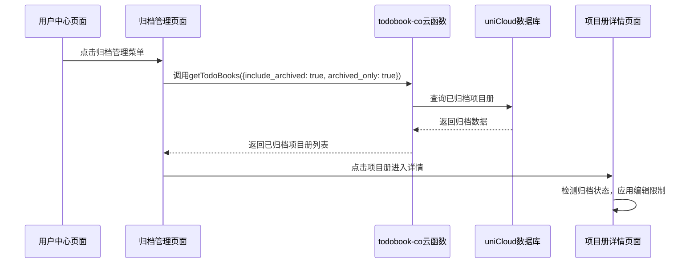

# 归档管理功能设计文档

## 概述

本设计文档定义了将"数据统计"功能替换为"归档管理"功能的技术实现方案。该功能将为用户提供一个专门的页面来查看和管理已归档的项目册，并对归档项目册实施编辑限制。

## 架构设计

### 1. 总体架构

```
用户中心页面 → 归档管理页面 → 归档项目册详情
      ↓           ↓              ↓
  菜单更新    新增归档页面    编辑限制实现
```

### 2. 数据流设计



## 组件设计

### 1. 页面组件结构

```
/pages/
├── ucenter/
│   └── ucenter.vue                    # 修改：更新菜单项
├── archive-management/                # 新增：归档管理模块
│   ├── index.vue                     # 归档管理主页面
│   ├── index.scss                    # 页面样式
│   └── composables/
│       └── useArchiveData.js         # 归档数据管理
└── todobooks/
    ├── detail.vue                    # 修改：添加归档状态检测
    └── components/
        └── TodoBookActionSheet.vue   # 修改：归档状态菜单限制
```

### 2. 组合式函数设计

#### useArchiveData.js
```javascript
import { ref, computed } from 'vue'

export function useArchiveData() {
  const archivedBooks = ref([])
  const loading = ref(false)
  const error = ref(null)
  
  // 归档统计数据计算
  const archiveStats = computed(() => {
    const books = archivedBooks.value
    
    if (!books.length) {
      return {
        totalBooks: 0,
        totalTasks: 0,
        completedTasks: 0,
        completionRate: 0,
        totalMembers: 0
      }
    }
    
    // 统计总数据
    const totalBooks = books.length
    const totalTasks = books.reduce((sum, book) => sum + (book.item_count || 0), 0)
    const completedTasks = books.reduce((sum, book) => sum + (book.completed_count || 0), 0)
    const completionRate = totalTasks > 0 ? Math.round((completedTasks / totalTasks) * 100) : 0
    
    // 统计去重成员数（基于成员ID去重）
    const memberIds = new Set()
    books.forEach(book => {
      if (book.members && Array.isArray(book.members)) {
        book.members.forEach(member => memberIds.add(member.user_id))
      } else {
        // 如果没有成员详情，至少计算创建者
        memberIds.add(book.creator_id)
      }
    })
    const totalMembers = memberIds.size
    
    return {
      totalBooks,
      totalTasks,
      completedTasks,
      completionRate,
      totalMembers
    }
  })
  
  const loadArchivedBooks = async (options = {}) => {
    try {
      loading.value = true
      error.value = null
      
      // 调用云函数获取已归档项目册，包含成员信息用于统计
      const todoBookCo = uniCloud.importObject('todobook-co')
      const result = await todoBookCo.getTodoBooks({
        include_archived: true,
        archived_only: true,
        include_members: true,  // 需要成员信息来计算去重成员数
        ...options
      })
      
      if (result.code === 0) {
        archivedBooks.value = result.data || []
        return result.data || []
      }
      throw new Error(result.message || '加载归档项目册失败')
      
    } catch (err) {
      console.error('加载归档项目册失败:', err)
      error.value = err.message
      throw err
    } finally {
      loading.value = false
    }
  }
  
  const unarchiveTodoBook = async (bookId) => {
    // 取消归档操作
    const todoBookCo = uniCloud.importObject('todobook-co')
    const result = await todoBookCo.updateTodoBook(bookId, {
      is_archived: false,
      archived_at: null
    })
    
    if (result.code === 0) {
      // 重新加载归档数据
      await loadArchivedBooks()
    }
    
    return result
  }
  
  return {
    archivedBooks,
    loading,
    error,
    archiveStats,
    loadArchivedBooks,
    unarchiveTodoBook
  }
}
```

## 界面设计

### 1. useBookData扩展

在现有的`useBookData.js`中添加归档相关方法：

```javascript
// 在useBookData中添加
const loadArchivedTodoBooks = async (options = {}) => {
  const todoBookCo = uniCloud.importObject('todobook-co')
  const result = await todoBookCo.getTodoBooks({
    include_archived: true,
    archived_only: true,
    ...options
  })
  
  if (result.code === 0) {
    return result.data || []
  }
  throw new Error(result.message || '加载归档项目册失败')
}
```

### 2. 归档管理页面UI设计

#### 页面布局
```vue
<template>
  <view class="archive-page">
    <!-- 顶部标题栏 -->
    <view class="page-header">
      <text class="page-title">归档管理</text>
    </view>
    
    <!-- 归档统计卡片 -->
    <view class="stats-section">
      <view class="stats-card">
        <view class="stats-header">
          <uni-icons type="chart-pie" size="20" color="#007AFF" />
          <text class="stats-title">归档统计</text>
        </view>
        <view class="stats-grid">
          <view class="stat-item">
            <text class="stat-number">{{ archiveStats.totalBooks }}</text>
            <text class="stat-label">项目册</text>
          </view>
          <view class="stat-item">
            <text class="stat-number">{{ archiveStats.totalTasks }}</text>
            <text class="stat-label">总任务</text>
          </view>
          <view class="stat-item">
            <text class="stat-number">{{ archiveStats.completedTasks }}</text>
            <text class="stat-label">已完成</text>
          </view>
          <view class="stat-item">
            <text class="stat-number">{{ archiveStats.completionRate }}%</text>
            <text class="stat-label">完成率</text>
          </view>
        </view>
        <view class="stats-footer">
          <text class="stats-summary">共有 {{ archiveStats.totalMembers }} 位成员参与了这些项目</text>
        </view>
      </view>
    </view>
    
    <!-- 归档项目册列表 -->
    <view class="archive-list">
      <view 
        v-for="book in archivedBooks" 
        :key="book._id"
        class="archive-card"
        @click="openArchivedBook(book)">
        
        <!-- 简化的卡片内容 -->
        <view class="card-content">
          <view class="book-header">
            <view class="book-icon-small" :style="{ backgroundColor: book.color }">
              <uni-icons :type="book.icon" size="16" color="#ffffff" />
            </view>
            <view class="book-info">
              <text class="book-title">{{ book.title }}</text>
              <text class="archive-date">归档于 {{ formatDate(book.archived_at) }}</text>
            </view>
            <view class="book-menu" @click.stop="showArchiveActions(book)">
              <uni-icons type="more-filled" size="16" color="#999" />
            </view>
          </view>
          
          <!-- 简化的统计信息 -->
          <view class="book-stats">
            <text class="stat-text">{{ book.item_count || 0 }} 任务</text>
            <text class="stat-divider">·</text>
            <text class="stat-text">{{ book.member_count || 1 }} 成员</text>
            <text class="stat-divider">·</text>
            <text class="stat-text">{{ calculateProgress(book) }}% 完成</text>
          </view>
        </view>
      </view>
    </view>
    
    <!-- 空状态 -->
    <view v-if="!loading && archivedBooks.length === 0" class="empty-state">
      <uni-icons type="folder" size="60" color="#ccc" />
      <text class="empty-text">暂无归档项目册</text>
    </view>
  </view>
</template>
```

#### 样式设计规范
```scss
.archive-page {
  background-color: #f5f5f5;
  min-height: 100vh;
}

// 统计卡片样式
.stats-section {
  padding: 20rpx;
  
  .stats-card {
    background: linear-gradient(135deg, #667eea 0%, #764ba2 100%);
    border-radius: 20rpx;
    padding: 30rpx;
    color: #ffffff;
    
    .stats-header {
      display: flex;
      align-items: center;
      margin-bottom: 24rpx;
      
      .stats-title {
        font-size: 32rpx;
        font-weight: 600;
        margin-left: 16rpx;
      }
    }
    
    .stats-grid {
      display: flex;
      justify-content: space-between;
      margin-bottom: 24rpx;
      
      .stat-item {
        text-align: center;
        flex: 1;
        
        .stat-number {
          display: block;
          font-size: 48rpx;
          font-weight: bold;
          margin-bottom: 8rpx;
          color: #ffffff;
        }
        
        .stat-label {
          font-size: 24rpx;
          color: rgba(255, 255, 255, 0.8);
        }
      }
    }
    
    .stats-footer {
      text-align: center;
      padding-top: 20rpx;
      border-top: 1rpx solid rgba(255, 255, 255, 0.2);
      
      .stats-summary {
        font-size: 26rpx;
        color: rgba(255, 255, 255, 0.9);
      }
    }
  }
}

.archive-card {
  background: #ffffff;
  margin: 20rpx;
  border-radius: 16rpx;
  padding: 24rpx;
  box-shadow: 0 2rpx 8rpx rgba(0, 0, 0, 0.06);
  
  // 比常规卡片更紧凑的设计
  .card-content {
    .book-header {
      display: flex;
      align-items: center;
      
      .book-icon-small {
        width: 56rpx;
        height: 56rpx;
        border-radius: 12rpx;
        display: flex;
        align-items: center;
        justify-content: center;
        margin-right: 24rpx;
      }
      
      .book-info {
        flex: 1;
        
        .book-title {
          font-size: 30rpx;
          font-weight: 500;
          color: #333;
          display: block;
          margin-bottom: 8rpx;
        }
        
        .archive-date {
          font-size: 24rpx;
          color: #999;
        }
      }
    }
    
    .book-stats {
      margin-top: 20rpx;
      display: flex;
      align-items: center;
      
      .stat-text {
        font-size: 24rpx;
        color: #666;
      }
      
      .stat-divider {
        margin: 0 16rpx;
        color: #ccc;
      }
    }
  }
}
```

## 数据模型

### 1. 云函数接口扩展

现有的`getTodoBooks`云函数已经支持归档相关参数：

```javascript
// todobook-co/module/todobook/get-todobooks.js
async getTodoBooks(params = {}) {
  const {
    page = 1,
    pageSize = 20,
    keyword = '',
    include_archived = false,  // 是否包含已归档项目册
    archived_only = false      // 只获取已归档项目册
  } = params
  
  // 构建查询条件
  const whereCondition = {
    creator_id: this.uid
  }
  
  if (archived_only) {
    whereCondition.is_archived = true
  } else if (!include_archived) {
    whereCondition.is_archived = db.command.neq(true)
  }
  
  // 执行查询...
}
```

### 2. 数据库查询优化

针对归档管理页面的数据查询优化：

```javascript
// 归档项目册查询，按归档时间倒序排列
const query = db.collection('todo-books')
  .where({
    creator_id: this.uid,
    is_archived: true
  })
  .field({
    _id: true,
    title: true,
    description: true,
    color: true,
    icon: true,
    item_count: true,
    completed_count: true,
    member_count: true,
    archived_at: true,
    created_at: true
  })
  .orderBy('archived_at', 'desc')  // 最近归档的在前
```

## 编辑限制实现

### 1. 项目册详情页面限制

在`/pages/todobooks/detail.vue`中添加归档状态检测：

```javascript
// 检测归档状态
const isArchived = computed(() => {
  return bookData.value?.is_archived === true
})

// 限制编辑操作
const canEdit = computed(() => {
  return !isArchived.value && hasPermission.value
})
```

### 2. 任务操作限制

```javascript
// 在任务组件中添加归档检测
const showTaskActions = computed(() => {
  return !props.isArchived && hasEditPermission.value
})
```

### 3. 评论功能限制

```javascript
// 评论输入框显示控制
const canComment = computed(() => {
  return !bookData.value?.is_archived && hasCommentPermission.value
})
```

### 4. 操作菜单限制

在`TodoBookActionSheet.vue`中添加归档状态判断：

```javascript
const availableActions = computed(() => {
  const actions = []
  
  if (props.bookData?.is_archived) {
    // 归档项目册只显示分享和删除
    if (props.showShare) actions.push('share')
    if (props.showDelete) actions.push('delete')
  } else {
    // 正常项目册显示所有操作
    if (props.showPin) actions.push('pin')
    if (props.showEdit) actions.push('edit')
    if (props.showMembers) actions.push('members')
    if (props.showShare) actions.push('share')
    if (props.showArchive) actions.push('archive')
    if (props.showDelete) actions.push('delete')
  }
  
  return actions
})
```

## 路由配置

### 1. pages.json配置

```json
{
  "pages": [
    {
      "path": "pages/archive-management/index",
      "style": {
        "navigationBarTitleText": "归档管理",
        "navigationBarBackgroundColor": "#ffffff",
        "navigationBarTextStyle": "black",
        "backgroundColor": "#f5f5f5",
        "enablePullDownRefresh": true
      }
    }
  ]
}
```

### 2. 导航参数设计

```javascript
// 从归档管理页面进入详情页
const openArchivedBook = (book) => {
  uni.navigateTo({
    url: `/pages/todobooks/detail?id=${book._id}&from=archive&archived=true`
  })
}

// 在详情页面接收参数
onLoad((options) => {
  const isFromArchive = options.from === 'archive'
  const isArchived = options.archived === 'true'
  
  // 设置页面状态...
})
```

## 错误处理

### 1. 网络错误处理

```javascript
const loadArchivedBooks = async () => {
  try {
    loading.value = true
    const books = await loadArchivedTodoBooks()
    archivedBooks.value = books
  } catch (error) {
    console.error('加载归档项目册失败:', error)
    uni.showToast({
      title: '加载失败，请重试',
      icon: 'none'
    })
  } finally {
    loading.value = false
  }
}
```

### 2. 权限错误处理

```javascript
const handlePermissionError = (error) => {
  if (error.code === 'PERMISSION_DENIED') {
    uni.showToast({
      title: '无权限访问',
      icon: 'none'
    })
    setTimeout(() => {
      uni.navigateBack()
    }, 1500)
  }
}
```

## 测试策略

### 1. 单元测试

- 测试`useArchiveData`组合式函数的各个方法
- 测试归档状态检测逻辑
- 测试编辑限制逻辑

### 2. 集成测试

- 测试从用户中心到归档管理页面的导航
- 测试归档项目册列表加载
- 测试归档项目册详情页面的限制功能

### 3. 用户界面测试

- 测试不同屏幕尺寸下的布局适配
- 测试加载状态和空状态的显示
- 测试操作菜单的显示限制

## 性能考虑

### 1. 数据加载优化

- 使用字段筛选减少数据传输量
- 实现下拉刷新和分页加载
- 缓存归档项目册数据（本地存储）

### 2. 渲染优化

- 使用虚拟列表处理大量归档项目册
- 图片懒加载
- 防抖处理用户操作

### 3. 内存管理

- 页面卸载时清理事件监听
- 及时清理无用的响应式数据