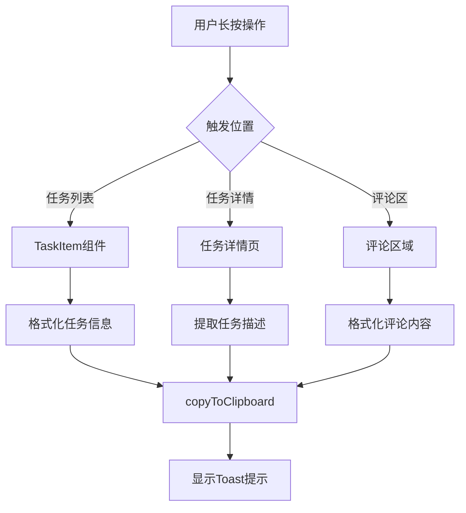

# Design Document - 任务信息复制功能

## Overview

本设计文档描述了在任务管理应用中实现长按复制功能的技术方案。该功能允许用户通过长按手势快速复制任务信息、任务描述和评论内容。设计充分利用了现有的组件结构和复制基础设施，通过添加长按事件处理和内容格式化逻辑来实现需求。

## Architecture

### 整体架构



### 技术方案

1. **长按事件处理**：使用 uni-app 的 `@longtap` 事件，设置 350ms 触发阈值
2. **内容格式化**：创建专门的格式化函数处理不同类型的复制内容
3. **复制功能**：复用现有的 `copyToClipboard` 函数
4. **用户反馈**：使用 `uni.showToast` 提供即时反馈

## Components and Interfaces

### 1. TaskItem 组件增强

**文件**: `/pages/todobooks/components/task/TaskItem.vue`

**修改内容**：
- 在任务项根元素添加 `@longtap` 事件处理
- 实现 `handleLongPress` 方法
- 调用格式化函数生成复制内容

**接口设计**：
```javascript
// 长按处理方法
const handleLongPress = () => {
  const formattedText = formatTaskInfo(props.task)
  copyToClipboard(formattedText, '已复制任务信息')
}
```

### 2. 任务详情页增强

**文件**: `/pages/tasks/detail.vue`

**修改内容**：
- 在描述区域的 `<view>` 元素添加 `@longtap` 事件
- 实现描述复制逻辑

**接口设计**：
```javascript
// 长按描述处理
const handleDescriptionLongPress = () => {
  if (task.value?.description) {
    copyToClipboard(task.value.description, '已复制任务描述')
  }
}
```

### 3. 评论区域增强

**文件**: `/pages/tasks/detail.vue` (评论部分)

**修改内容**：
- 在评论内容元素添加 `@longtap` 事件
- 实现评论格式化和复制逻辑

**接口设计**：
```javascript
// 长按评论处理
const handleCommentLongPress = (comment) => {
  const formattedText = formatCommentInfo(comment)
  copyToClipboard(formattedText, '已复制评论')
}
```

### 4. 格式化工具函数

**新建文件**: `/pages/todobooks/utils/copyFormatters.js`

**导出函数**：
```javascript
// 格式化任务信息
export const formatTaskInfo = (task) => { /* ... */ }

// 格式化评论信息
export const formatCommentInfo = (comment) => { /* ... */ }

// 格式化时间
export const formatDateTime = (timestamp) => { /* ... */ }
```

## Data Models

### 复制内容格式定义

#### 任务信息格式
```
【任务标题】{title}
【描述】{description}
【标签】{tags}
【截止日期】{due_date}
【预算】{budget}
【实际花费】{actual_cost}
【创建时间】{created_at}
【子任务】
  - {subtask1}
  - {subtask2}
```

#### 评论信息格式
```
【评论者】{author_name}
【时间】{created_at}
【内容】{content}
```

### 数据处理规则

1. **空值处理**：空字段显示"未设置"或省略该行
2. **时间格式**：使用 `YYYY年MM月DD日 HH:mm` 格式
3. **标签处理**：用逗号分隔多个标签
4. **内容截断**：超过5000字符时截断并添加提示

## Error Handling

### 错误场景处理

1. **复制失败**
   - 捕获 `copyToClipboard` 异常
   - 显示错误提示："复制失败，请重试"

2. **权限问题**
   - H5平台可能因浏览器权限限制失败
   - 提供降级方案或引导用户手动复制

3. **空内容处理**
   - 检查内容是否为空
   - 空内容不触发复制操作

### 错误处理代码示例
```javascript
try {
  await copyToClipboard(text, successMessage)
} catch (error) {
  console.error('复制失败:', error)
  uni.showToast({
    title: '复制失败，请重试',
    icon: 'error'
  })
}
```

## Testing Strategy

### 单元测试

1. **格式化函数测试**
   - 测试各种任务数据的格式化输出
   - 测试空值和特殊字符处理
   - 测试内容截断逻辑

2. **时间格式化测试**
   - 测试不同时间戳的格式化结果
   - 测试时区处理

### 集成测试

1. **长按事件触发**
   - 测试不同平台的长按事件响应
   - 测试触发时间阈值

2. **复制功能测试**
   - 测试H5平台复制功能
   - 测试小程序平台复制功能
   - 测试App平台复制功能

3. **用户反馈测试**
   - 测试Toast提示显示
   - 测试错误提示显示

### 端到端测试

1. **完整流程测试**
   - 长按任务项 → 查看剪贴板内容
   - 长按描述 → 验证复制内容
   - 长按评论 → 验证格式化结果

2. **边界条件测试**
   - 超长内容复制
   - 特殊字符处理
   - 并发复制操作

## 性能考虑

1. **防抖处理**：避免长按过程中多次触发
2. **内容缓存**：对于大量数据的格式化结果可考虑缓存
3. **异步处理**：复制操作应异步执行，避免阻塞UI

## 安全考虑

1. **内容过滤**：复制前检查敏感信息
2. **权限验证**：确保用户有权限查看和复制相关内容
3. **XSS防护**：对复制内容进行适当的转义处理