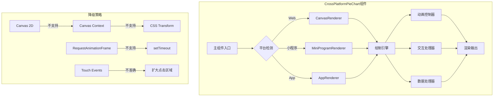

# Design Document - 跨平台饼图组件

## Overview

本设计文档描述了一个跨平台兼容的饼图组件的技术架构和实现方案。该组件将通过条件编译、渐进增强和优雅降级策略，确保在Web、微信小程序、Android和iOS平台上都能稳定运行。

### 设计原则
- **渐进增强**: 从基础功能开始，根据平台能力逐步增强
- **优雅降级**: 当高级功能不可用时，自动降级到基础实现
- **平台隔离**: 使用条件编译隔离平台特定代码
- **性能优先**: 根据平台性能自动调整渲染策略

## Architecture

### 组件架构图



### 分层架构

1. **表现层**: 负责UI渲染和用户交互
2. **适配层**: 处理平台差异和API兼容
3. **核心层**: 数据处理和业务逻辑
4. **工具层**: 通用工具函数和辅助方法

## Components and Interfaces

### 1. 主组件 - CrossPlatformPieChart.vue

```typescript
interface CrossPlatformPieChartProps {
  // 数据属性
  chartData: ChartDataItem[]      // 图表数据
  width?: number                   // 宽度（默认300）
  height?: number                  // 高度（默认300）
  
  // 功能开关
  enableAnimation?: boolean        // 启用动画（自动检测）
  enableInteraction?: boolean      // 启用交互（默认true）
  showLabels?: boolean            // 显示标签（默认true）
  
  // 样式配置
  innerRadiusRatio?: number       // 内圆半径比例（默认0.6）
  selectedOffset?: number         // 选中偏移量（默认8）
  hoverOffset?: number           // 悬停偏移量（默认4）
}

interface ChartDataItem {
  id: string                      // 唯一标识
  value: number                   // 数值
  color: string                   // 颜色
  label?: string                  // 标签文本
  showExtensionLabel?: boolean   // 显示延伸标签
}
```

### 2. 渲染器接口

```typescript
interface IRenderer {
  init(canvasId: string, context?: any): Promise<boolean>
  draw(data: ChartDataItem[], options: DrawOptions): void
  clear(): void
  destroy(): void
  supportsAnimation(): boolean
  supportsInteraction(): boolean
}

interface DrawOptions {
  animationProgress?: number
  selectedSegment?: string
  hoveredSegment?: string
  showLabels?: boolean
}
```

### 3. 平台适配器

```typescript
interface IPlatformAdapter {
  createCanvasContext(canvasId: string, component?: any): any
  getCanvasNode(selector: string): Promise<any>
  getTouchCoordinates(event: TouchEvent, canvas: any): Promise<{x: number, y: number}>
  requestAnimationFrame(callback: Function): number
  cancelAnimationFrame(id: number): void
  isHighPerformance(): boolean
}
```

### 4. 动画控制器

```typescript
interface IAnimationController {
  start(duration: number, onUpdate: (progress: number) => void): void
  stop(): void
  pause(): void
  resume(): void
  isAnimating(): boolean
}
```

## Data Models

### 1. 扇形数据模型

```typescript
interface SegmentData {
  id: string
  startAngle: number
  endAngle: number
  midAngle: number
  innerRadius: number
  outerRadius: number
  data: ChartDataItem
}
```

### 2. 触摸事件数据

```typescript
interface TouchData {
  x: number
  y: number
  timestamp: number
  target?: SegmentData
}
```

### 3. 渲染状态

```typescript
interface RenderState {
  isInitialized: boolean
  isAnimating: boolean
  selectedSegmentId?: string
  hoveredSegmentId?: string
  lastRenderTime: number
  renderCount: number
}
```

## Platform-Specific Implementations

### Web平台 (H5)

```javascript
// #ifdef H5
class WebRenderer implements IRenderer {
  // 使用标准Canvas 2D API
  // 支持requestAnimationFrame
  // 使用getBoundingClientRect获取坐标
}
// #endif
```

### 微信小程序平台

```javascript
// #ifdef MP-WEIXIN
class WeixinRenderer implements IRenderer {
  // 使用wx.createCanvasContext
  // 使用setTimeout替代requestAnimationFrame
  // 直接使用touch.x/touch.y坐标
}
// #endif
```

### App平台 (Android/iOS)

```javascript
// #ifdef APP-PLUS
class AppRenderer implements IRenderer {
  // 使用uni.createCanvasContext
  // 性能检测后决定是否启用动画
  // 使用createSelectorQuery获取节点信息
}
// #endif
```

## Rendering Strategy

### 1. 基础渲染流程

```
1. 初始化Canvas上下文
2. 计算扇形角度和位置
3. 绘制扇形（批量处理）
4. 绘制分隔线
5. 绘制标签（可选）
6. 执行平台特定的刷新操作
```

### 2. 性能优化策略

- **批量绘制**: 收集所有绘制操作，一次性执行
- **防抖处理**: 频繁更新时使用50ms防抖
- **脏区域检测**: 只重绘变化的部分
- **离屏渲染**: 复杂图形先在离屏Canvas绘制

### 3. 降级策略

| 功能 | 一级方案 | 二级方案 | 三级方案 |
|-----|---------|---------|---------|
| Canvas | Canvas 2D | Canvas Context | CSS/SVG |
| 动画 | RAF | setTimeout | 无动画 |
| 触摸 | 精确坐标 | 近似坐标 | 扩大区域 |
| 标签 | Canvas绘制 | DOM覆盖 | 不显示 |

## Error Handling

### 1. 初始化错误处理

```typescript
async function initializeCanvas(retries = 3): Promise<boolean> {
  for (let i = 0; i < retries; i++) {
    try {
      const context = await createContext()
      if (context) return true
    } catch (error) {
      console.warn(`Canvas初始化失败，第${i + 1}次尝试`, error)
      await delay((i + 1) * 200)
    }
  }
  // 降级到CSS实现
  return fallbackToCSS()
}
```

### 2. 渲染错误处理

- Canvas API调用失败：记录错误，跳过当前帧
- 数据格式错误：显示空状态
- 内存不足：清理缓存，简化渲染

### 3. 交互错误处理

- 坐标计算失败：使用默认值
- 事件绑定失败：禁用交互功能
- 触摸检测失败：扩大检测范围

## Testing Strategy

### 1. 单元测试

- 数据处理逻辑测试
- 角度计算测试
- 坐标转换测试
- 碰撞检测测试

### 2. 平台测试

- Web平台：Chrome、Firefox、Safari
- 微信小程序：开发者工具、真机
- Android：多版本、多机型
- iOS：多版本测试

### 3. 性能测试

- 渲染帧率测试
- 内存占用测试
- CPU使用率测试
- 大数据量测试

### 4. 兼容性测试矩阵

| 平台 | Canvas | 动画 | 触摸 | 标签 | 预期结果 |
|-----|--------|------|------|------|---------|
| Web | ✅ | ✅ | ✅ | ✅ | 完整功能 |
| 微信 | ✅ | ⚠️ | ✅ | ✅ | 基础动画 |
| Android | ✅ | ⚠️ | ⚠️ | ✅ | 自动降级 |
| iOS | ✅ | ✅ | ✅ | ✅ | 完整功能 |

## Implementation Details

### 1. 条件编译结构

```vue
<template>
  <!-- 通用模板 -->
  <view class="cross-platform-pie-chart">
    <canvas 
      :canvas-id="canvasId"
      :style="canvasStyle"
      @touchstart="handleTouchStart"
      @touchmove="handleTouchMove"
      @touchend="handleTouchEnd"
    />
    <!-- 降级方案：CSS饼图 -->
    <view v-if="useCSSFallback" class="css-pie-chart">
      <!-- CSS实现 -->
    </view>
  </view>
</template>

<script>
// 平台检测
const platform = uni.getSystemInfoSync().platform

// 条件导入
// #ifdef H5
import WebRenderer from './renderers/WebRenderer'
// #endif
// #ifdef MP-WEIXIN
import WeixinRenderer from './renderers/WeixinRenderer'
// #endif
// #ifdef APP-PLUS
import AppRenderer from './renderers/AppRenderer'
// #endif
</script>
```

### 2. 自动能力检测

```javascript
function detectCapabilities() {
  return {
    hasRAF: typeof requestAnimationFrame !== 'undefined',
    hasCanvas2D: checkCanvas2DSupport(),
    hasTouchEvents: 'ontouchstart' in window,
    isHighPerf: checkPerformance(),
    platform: detectPlatform()
  }
}
```

### 3. 渲染器工厂

```javascript
function createRenderer(capabilities) {
  // #ifdef H5
  if (capabilities.platform === 'web') {
    return new WebRenderer(capabilities)
  }
  // #endif
  
  // #ifdef MP-WEIXIN
  if (capabilities.platform === 'weixin') {
    return new WeixinRenderer(capabilities)
  }
  // #endif
  
  // #ifdef APP-PLUS
  if (capabilities.platform === 'app') {
    return new AppRenderer(capabilities)
  }
  // #endif
  
  // 降级方案
  return new FallbackRenderer()
}
```

## Performance Considerations

### 1. 渲染优化

- 使用`will-change`提示浏览器优化
- 避免频繁的DOM操作
- 使用`transform`代替`left/top`
- 批量更新减少重排重绘

### 2. 内存优化

- 及时清理不用的Canvas上下文
- 限制缓存数据大小
- 使用对象池减少GC压力
- 避免内存泄漏

### 3. 动画优化

- 使用CSS动画替代JS动画（降级时）
- 控制动画帧率（最高60fps）
- 低性能设备自动关闭动画
- 使用缓动函数优化视觉效果

## Migration Plan

### 从PieChartCanvas.vue迁移

1. **API兼容**: 保持相同的props和events接口
2. **视觉一致**: 尽可能保持相同的视觉效果
3. **渐进迁移**: 先在一个页面测试，逐步推广
4. **回退方案**: 保留原组件，可快速切换

### 迁移检查清单

- [ ] 数据格式兼容
- [ ] 事件处理兼容
- [ ] 样式效果一致
- [ ] 性能无退化
- [ ] 各平台测试通过