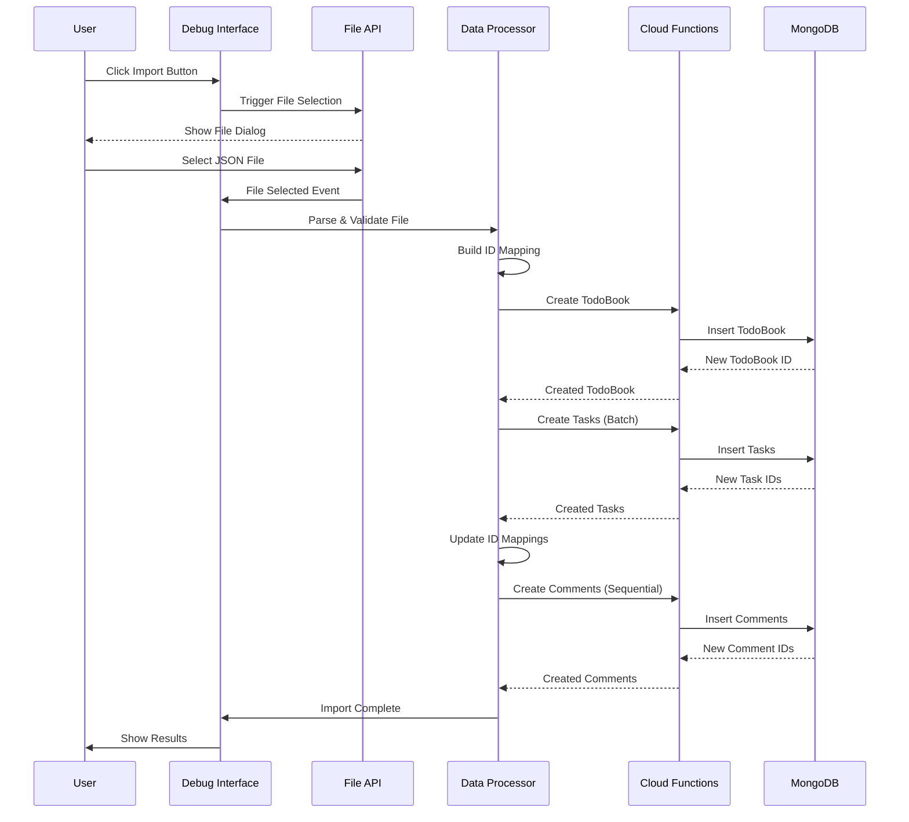
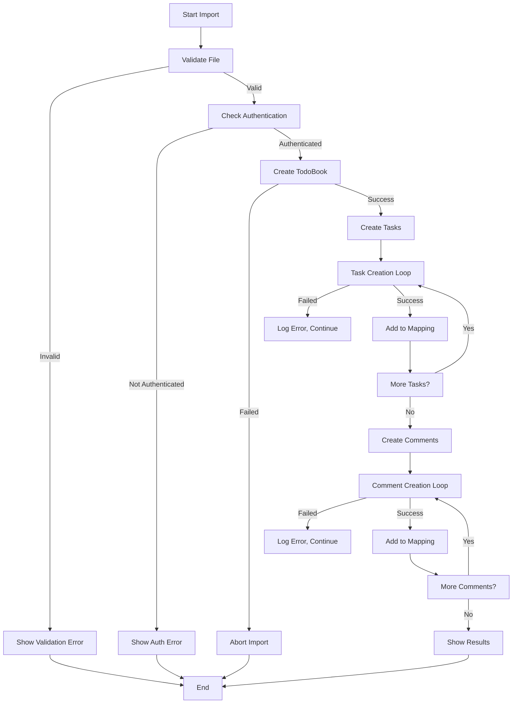

# Design Document - Data Import Feature

## Overview

The data import feature enables users to import TodoBook projects with tasks and comments from JSON export files through the debug interface. The system handles data transformation, ID mapping, dependency resolution, and user ownership assignment to ensure seamless data restoration.

## Architecture

### System Flow


## Components and Interfaces

### 1. File Handler Component
**Location**: `/pages/debug/debug.vue` (methods section)

**Responsibilities**:
- Trigger file selection dialog
- Validate file format and structure
- Read file content as text
- Parse JSON data

**Key Methods**:
```javascript
triggerImportData() // Trigger file selection
handleFileSelect(event) // Handle file selection event
readFileAsText(file) // Read file content
```

### 2. Data Processor Component
**Location**: `/pages/debug/debug.vue` (methods section)

**Responsibilities**:
- Parse and validate import data structure
- Build ID mapping tables for dependencies
- Coordinate import process flow
- Handle error reporting and logging

**Key Methods**:
```javascript
importDataFromFile(file) // Main import orchestrator
performDataImport(importData, currentUserId) // Execute import steps
buildIdMappings() // Create ID mapping tables
```

### 3. TodoBook Service Interface
**Location**: Existing `useBookData` composable

**Methods Used**:
- `createTodoBook(bookData)` - Creates new TodoBook

### 4. Cloud Function Interface
**Location**: Existing `todobook-co` cloud object

**Methods Used**:
- `createTodoItem(taskData)` - Creates individual tasks
- `addTaskComment(taskId, content, parentCommentId)` - Creates comments with reply relationships

## Data Models

### Import Data Structure
```javascript
{
  metadata: {
    exportVersion: "1.0.0",
    exportTime: "ISO Date String",
    exportBy: "user_id",
    dataType: "todobook-full-export"
  },
  todobook: {
    _id: "original_book_id",
    title: "string",
    description: "string",
    color: "#hex_color",
    icon: "icon_name",
    // ... other book properties
  },
  tasks: [{
    _id: "original_task_id",
    todobook_id: "original_book_id",
    title: "string",
    description: "string",
    tags: [{ name: "string", color: "#hex" }],
    status: "todo|in_progress|completed",
    priority: "low|medium|high|urgent",
    comments: [{
      _id: "original_comment_id",
      content: "string",
      user_id: "original_user_id",
      reply_to: "original_comment_id", // dependency
      created_at: "ISO Date String",
      is_deleted: boolean
    }],
    // ... other task properties
  }]
}
```

### ID Mapping Tables
```javascript
const taskIdMapping = new Map() // oldTaskId -> newTaskId
const commentIdMapping = new Map() // oldCommentId -> newCommentId
```

### Transformed Data Structures

**TodoBook Creation Data**:
```javascript
{
  title: "string",
  description: "string", 
  color: "#hex_color",
  icon: "icon_name",
  is_shared: false,
  share_type: 'private'
}
```

**Task Creation Data**:
```javascript
{
  todobook_id: "new_book_id",
  title: "string",
  description: "string",
  tags: [{ name: "string", color: "#hex" }],
  priority: "medium",
  status: "todo",
  level: 0,
  budget: null,
  due_date: null,
  progress: 0,
  actual_cost: 0,
  estimated_hours: 0
}
```

**Comment Creation Data**:
```javascript
{
  todoitem_id: "new_task_id", 
  content: "string",
  reply_to: "new_comment_id", // mapped from original
  user_id: "current_user_id"
}
```

## Error Handling

### Error Categories

1. **Validation Errors**
   - Invalid JSON format
   - Missing required fields
   - Invalid data types

2. **Authentication Errors**
   - User not logged in
   - Token expired

3. **Creation Errors**
   - TodoBook creation failure (critical - abort import)
   - Task creation failure (continue with remaining tasks)
   - Comment creation failure (continue with remaining comments)

### Error Handling Strategy



### Logging Strategy

All operations use the existing `log()` method in debug interface:
- Progress updates with entity identification
- Success messages with ID mappings
- Detailed error messages for debugging
- Final completion status

## Testing Strategy

### Unit Test Areas

1. **File Validation Tests**
   - Valid JSON structure validation
   - Required field presence validation
   - Data type validation

2. **Data Transformation Tests**
   - User ID replacement logic
   - ID mapping creation and usage
   - Comment reply relationship mapping

3. **Error Handling Tests**
   - Invalid file format handling
   - Authentication failure handling
   - Partial failure scenarios

### Integration Test Scenarios

1. **Complete Import Flow**
   - Import file with TodoBook, tasks, and comments
   - Verify all entities created with correct relationships
   - Verify user ownership assignment

2. **Dependency Resolution**
   - Import with comment reply chains
   - Verify reply relationships maintained with new IDs

3. **Error Recovery**
   - Import with some invalid tasks
   - Verify system continues and reports errors appropriately

### Manual Testing Checklist

1. File selection and validation
2. Progress feedback during import
3. Success/failure message display
4. Data integrity verification in database
5. User ownership verification

## Implementation Considerations

### Performance
- Sequential comment creation to maintain reply dependencies
- Batch task creation where possible
- Memory-efficient file reading for large imports

### Security
- File type validation (JSON only)
- User authentication verification
- Permission checks through existing cloud function security

### Maintenance
- Uses existing cloud function interfaces
- Follows established error handling patterns
- Integrates with existing debug interface structure