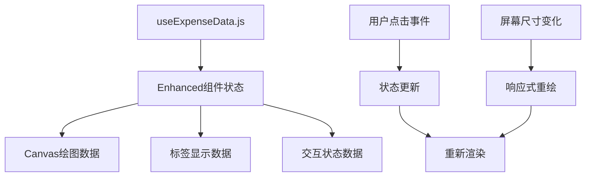

# Design Document

## Overview

增强型消费统计饼图功能将在现有 `ExpensePieChart.vue` 组件基础上进行升级，添加交互式延伸标签、点击切换中心显示、以及优化的标签列表样式。设计遵循现有的uni-app + Vue 3技术栈和组件化架构，确保与现有统计页面完美集成。

## Architecture

### 技术栈继承
- **绘图引擎**: 继续使用uni-app原生Canvas API，扩展现有绘图能力
- **组件框架**: Vue 3 Composition API + `<script setup>` 语法
- **状态管理**: 扩展 `useExpenseData.js` 添加交互状态
- **样式系统**: SCSS + 现有统计页面样式变量和混入

### 组件架构扩展

```
StatisticsExpenseTab.vue
├── EnhancedExpensePieChart.vue (增强版饼图组件)
│   ├── PieChartCanvas.vue (Canvas绘图子组件)
│   ├── PieChartLabels.vue (延伸标签子组件)  
│   └── PieChartCenter.vue (中心显示子组件)
└── ExpenseTagList.vue (优化版标签列表组件)
    └── ExpenseTagItem.vue (标签列表项组件)
```

### 数据流设计



## Components and Interfaces

### 1. EnhancedExpensePieChart.vue

**主要功能:**
- 集成Canvas绘图、延伸标签、中心显示
- 管理用户交互状态
- 协调子组件通信

**Props接口:**
```typescript
interface Props {
  expenseData: ExpenseItem[]
  width?: number
  height?: number
  showLabels?: boolean
  animationDuration?: number
}
```

**Events:**
```typescript
interface Events {
  'segment-click': (categoryId: string, category: ExpenseCategory) => void
  'chart-ready': () => void
}
```

### 2. PieChartCanvas.vue

**核心绘图组件:**
- 基于现有Canvas API绘制环形饼图
- 支持延伸标签线绘制
- 实现点击区域检测

**Canvas绘制扩展:**
```javascript
// 延伸标签线绘制算法
const drawExtensionLine = (ctx, startAngle, endAngle, radius, labelText) => {
  const midAngle = (startAngle + endAngle) / 2
  const lineStartX = centerX + Math.cos(midAngle) * radius
  const lineStartY = centerY + Math.sin(midAngle) * radius
  const lineEndX = centerX + Math.cos(midAngle) * (radius + 30)
  const lineEndY = centerY + Math.sin(midAngle) * (radius + 30)
  
  // 绘制引导线和标签
  ctx.strokeStyle = segmentColor
  ctx.lineWidth = 1
  ctx.beginPath()
  ctx.moveTo(lineStartX, lineStartY)
  ctx.lineTo(lineEndX, lineEndY)
  ctx.stroke()
}
```

### 3. PieChartCenter.vue

**中心显示组件:**
- 管理中心显示内容的切换
- 支持总支出和单个类别的动画切换
- 数字动画效果实现

**状态管理:**
```javascript
const centerDisplay = reactive({
  mode: 'total', // 'total' | 'category'
  currentCategory: null,
  displayAmount: 0,
  displayLabel: '总支出'
})
```

### 4. ExpenseTagList.vue

**优化版标签列表:**
- 重新设计列表项样式
- 添加彩色圆角图标
- 支持点击与饼图联动

**列表项设计:**
```vue
<template>
  <div class="expense-tag-item" @click="handleClick">
    <div class="tag-icon" :style="{ backgroundColor: item.color }">
      <uni-icons :type="item.icon" color="white" size="20"></uni-icons>
    </div>
    <div class="tag-content">
      <div class="tag-name">{{ item.name }}</div>
      <div class="tag-stats">
        <span class="percentage">{{ item.percentage }}%</span>
        <span class="amount">{{ item.amount }}</span>
        <span class="count">({{ item.count }}笔)</span>
      </div>
    </div>
  </div>
</template>
```

## Data Models

### 增强版支出数据模型

```typescript
interface EnhancedExpenseItem {
  id: string
  tagId: string
  tagName: string
  amount: number
  percentage: number
  count: number
  color: string
  icon: string
  visible: boolean // 是否显示延伸标签
}

interface PieChartState {
  selectedSegment: string | null
  centerMode: 'total' | 'category'
  isAnimating: boolean
  chartReady: boolean
}

interface ChartDimensions {
  canvasWidth: number
  canvasHeight: number
  centerX: number
  centerY: number
  outerRadius: number
  innerRadius: number
}
```

### 交互状态模型

```typescript
interface InteractionState {
  hoveredSegment: string | null
  clickedSegment: string | null
  lastClickTime: number
  touchStartPos: { x: number, y: number }
}
```

## Error Handling

### 1. Canvas 渲染错误处理
```javascript
const safeDrawChart = async () => {
  try {
    await drawPieChart()
    await drawExtensionLabels()
  } catch (error) {
    console.error('饼图绘制失败:', error)
    showFallbackUI()
  }
}
```

### 2. 数据异常处理
- 空数据显示占位图
- 数据格式校验
- 颜色分配失败回退方案

### 3. 响应式适配错误处理
- Canvas尺寸计算异常处理
- 设备适配失败回退方案

## Implementation Notes

### 性能优化策略
1. **Canvas优化**: 离屏Canvas预渲染静态部分
2. **动画优化**: requestAnimationFrame + 防抖机制
3. **事件优化**: 被动事件监听器减少阻塞
4. **内存管理**: 组件销毁时清理Canvas上下文

### 兼容性考虑
1. **uni-app多端兼容**: 使用uni-app标准API确保跨端一致性
2. **Canvas API兼容**: 检测Canvas支持情况并提供降级方案
3. **触摸事件兼容**: 统一处理touch和mouse事件

### 可维护性设计
1. **配置抽离**: 颜色、尺寸等配置统一管理
2. **工具函数复用**: 数学计算、颜色处理等工具函数
3. **类型定义**: 完整的TypeScript类型定义
4. **文档完善**: 组件API文档和使用示例