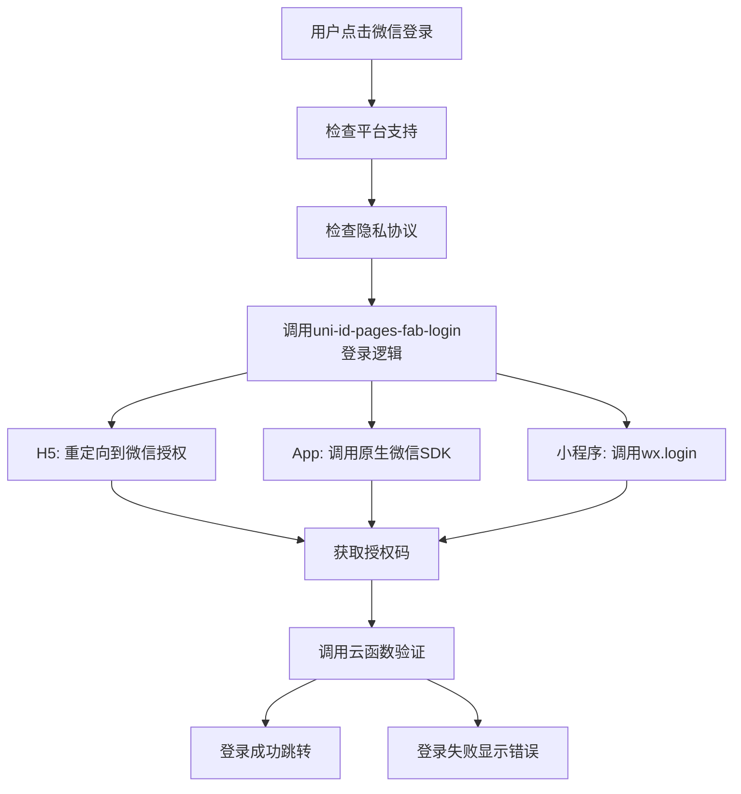

# 设计文档

## 概述

本设计文档描述了如何在项目根目录下的账号密码登录页面 (`/pages/login/login-withpwd.vue`) 中集成微信登录功能。设计方案将复用 uni-id-pages 模块的现有组件和逻辑，确保功能的一致性和可维护性。

**重要说明**: 所有修改都在项目根目录 `/pages/login/` 下进行，不修改 `/uni_modules/uni-id-pages/pages/login/` 中的文件。

## 架构

### 组件架构

```
/pages/login/login-withpwd.vue (项目根目录下的主页面)
├── uni-forms (现有表单)
├── uni-captcha (现有验证码)
├── uni-id-pages-agreements (现有协议组件)
├── WeChat Login Button (新增微信登录按钮)
└── uni-id-pages-fab-login (引用 uni_modules 中的悬浮登录组件 - 复用其登录逻辑)
```

### 数据流架构



## 组件和接口

### UI 组件设计

#### 微信登录按钮组件
- **位置**: 密码登录按钮下方，链接区域上方
- **样式**: 参考 uni-id-pages 中的微信登录按钮设计
- **图标**: 使用 `/uni_modules/uni-id-pages/static/login/uni-fab-login/weixin.png`
- **文本**: "微信登录"

#### 布局调整
- 保持现有表单布局不变
- 在登录按钮和链接区域之间添加微信登录选项
- 添加分隔线或"或"文字来区分两种登录方式

### 接口设计

#### 方法接口

```javascript
// 微信登录方法
wechatLogin() {
  // 调用 uni-id-pages-fab-login 的 login_before 方法
  this.$refs.uniFabLogin.login_before('weixin', false)
}

// 复用现有的登录成功处理
loginSuccess(result) {
  // 已在 mixin 中实现
}
```

#### 数据接口

```javascript
data() {
  return {
    // 现有数据保持不变
    showWechatLogin: true, // 控制微信登录按钮显示
  }
}
```

## 数据模型

### 页面数据模型

```javascript
{
  // 现有字段保持不变
  password: String,
  username: String,
  captcha: String,
  needCaptcha: Boolean,
  focusUsername: Boolean,
  focusPassword: Boolean,
  logo: String,
  uniIdRedirectUrl: String,
  
  // 新增字段
  showWechatLogin: Boolean, // 是否显示微信登录按钮
  wechatLoading: Boolean,   // 微信登录加载状态
}
```

### 登录结果数据模型

```javascript
// 微信登录成功返回的数据结构（复用 uni-id-pages 现有结构）
{
  code: 0,
  message: "登录成功",
  token: String,
  tokenExpired: Number,
  userInfo: {
    uid: String,
    username: String,
    nickname: String,
    avatar: String,
    // ...其他用户信息
  }
}
```

## 错误处理

### 错误类型定义

1. **平台不支持错误**
   - 错误码: `PLATFORM_NOT_SUPPORTED`
   - 处理: 显示 Toast 提示 "当前平台不支持微信登录"

2. **用户取消授权**
   - 错误码: `USER_CANCEL`
   - 处理: 静默处理，不显示错误信息

3. **网络错误**
   - 错误码: `NETWORK_ERROR`
   - 处理: 显示 Toast 提示 "网络连接失败，请重试"

4. **授权失败**
   - 错误码: `AUTH_FAILED`
   - 处理: 显示具体的错误信息

### 错误处理流程

```javascript
// 错误处理方法
handleWechatLoginError(error) {
  uni.hideLoading()
  
  switch(error.errCode) {
    case 'USER_CANCEL':
      // 用户取消，不显示错误
      break
    case 'PLATFORM_NOT_SUPPORTED':
      uni.showToast({
        title: '当前平台不支持微信登录',
        icon: 'none',
        duration: 3000
      })
      break
    default:
      uni.showToast({
        title: error.message || '登录失败，请重试',
        icon: 'none',
        duration: 3000
      })
  }
}
```

## 测试策略

### 单元测试

1. **微信登录按钮渲染测试**
   - 验证按钮是否正确显示
   - 验证按钮点击事件绑定

2. **登录逻辑测试**
   - 模拟微信登录成功场景
   - 模拟微信登录失败场景
   - 验证错误处理逻辑

### 集成测试

1. **平台兼容性测试**
   - H5 平台微信登录流程
   - App 平台微信登录流程
   - 小程序平台微信登录流程

2. **用户交互测试**
   - 密码登录和微信登录切换
   - 隐私协议确认流程
   - 登录成功后页面跳转

### 用户验收测试

1. **功能完整性**
   - 用户能够看到微信登录选项
   - 用户能够成功使用微信登录
   - 登录失败时显示适当错误信息

2. **用户体验**
   - 页面布局合理，不影响原有功能
   - 微信登录流程顺畅
   - 错误提示清晰易懂

## 技术实现细节

### 复用策略

1. **复用 uni-id-pages-fab-login 组件的登录逻辑**
   - 不修改组件本身，通过引用调用其方法
   - 利用其完整的平台适配和错误处理逻辑

2. **复用现有的 mixin 和样式**
   - 继续使用 login-page.mixin.js
   - 复用 login-page.scss 样式

3. **复用云函数接口**
   - 使用 uni-id-co 的 loginByWeixin 方法
   - 利用现有的用户状态管理逻辑

### 样式设计

```scss
// 微信登录按钮样式
.wechat-login-container {
  margin: 20px 0;
  display: flex;
  flex-direction: column;
  align-items: center;
}

.divider {
  display: flex;
  align-items: center;
  margin: 15px 0;
  color: #999;
  font-size: 12px;
}

.divider::before,
.divider::after {
  content: '';
  flex: 1;
  height: 1px;
  background-color: #e5e5e5;
  margin: 0 10px;
}

.wechat-login-btn {
  display: flex;
  align-items: center;
  justify-content: center;
  width: 100%;
  height: 44px;
  background-color: #07c160;
  border-radius: 4px;
  color: white;
  font-size: 16px;
}

.wechat-icon {
  width: 20px;
  height: 20px;
  margin-right: 8px;
}
```