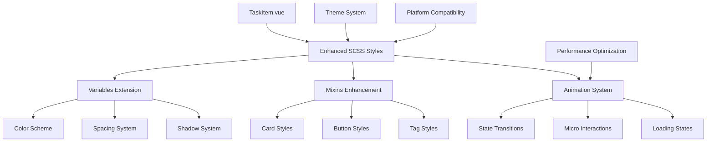

# 技术方案设计 - 任务展示样式优化

## 架构设计

### 总体策略
基于现有的 uni-app + Vue 3 + SCSS 架构，采用**渐进式优化**策略，保持组件API兼容性的同时升级视觉设计。主要通过扩展现有的样式系统和优化组件实现来达成目标。

### 核心设计原则
1. **保持组件接口稳定性** - 不改变TaskItem组件的props和事件接口
2. **扩展而非重写** - 在现有样式基础上扩展新的设计元素
3. **响应式优先** - 确保所有改进在多端都有良好表现
4. **性能友好** - 优化CSS选择器，减少重绘重排

## 技术选型

### 样式技术栈
- **SCSS预处理器** - 继续使用现有的SCSS系统
- **CSS变量** - 引入CSS自定义属性支持主题切换
- **CSS动画** - 使用transform和opacity实现高性能动画
- **Flexbox布局** - 优化现有的弹性布局实现

### 兼容性考虑
- **uni-app多端支持** - 确保H5、小程序、APP端的样式一致性
- **条件编译** - 使用uni-app条件编译处理平台差异
- **降级方案** - 为不支持新特性的平台提供基础样式

## 数据库设计

本次改进不涉及数据库结构变更，完全基于现有数据模型实现视觉优化。

## 接口设计

### 组件接口保持不变
```typescript
// TaskItem组件接口保持兼容
interface TaskItemProps {
  task: Task
  variant: 'card' | 'item'
  level: number
  index: number
  parentTask?: Task
  unreadCommentCount?: number
  isPinned: boolean
}
```

### 新增样式配置接口
```typescript
// 可选：未来扩展的主题配置接口
interface TaskStyleConfig {
  theme: 'light' | 'dark' | 'auto'
  animationEnabled: boolean
  compactMode: boolean
}
```

## 具体实现方案

### 1. 样式变量系统扩展

#### 1.1 新增颜色变量
```scss
// 新增现代化配色方案
$task-card-bg: #ffffff;
$task-card-bg-dark: #1c1c1e;
$task-card-hover: #f8f9fa;
$task-card-active: #f1f3f4;

// 改进的优先级配色
$priority-low-bg-new: linear-gradient(135deg, #e8f8f0 0%, #d4f1de 100%);
$priority-medium-bg-new: linear-gradient(135deg, #fff8e1 0%, #ffe0a3 100%);
$priority-high-bg-new: linear-gradient(135deg, #ffebee 0%, #ffcdd2 100%);
$priority-urgent-bg-new: linear-gradient(135deg, #ffebee 0%, #f8bbd9 100%);

// 新增阴影层次
$shadow-task-card: 0 2px 12px rgba(0, 0, 0, 0.08);
$shadow-task-hover: 0 4px 20px rgba(0, 0, 0, 0.12);
$shadow-task-active: 0 1px 4px rgba(0, 0, 0, 0.04);
```

#### 1.2 动画时长定义
```scss
$animation-bounce: cubic-bezier(0.68, -0.55, 0.265, 1.55);
$animation-smooth: cubic-bezier(0.25, 0.8, 0.25, 1);
$animation-quick: cubic-bezier(0.4, 0, 0.2, 1);
```

### 2. 组件样式重构

#### 2.1 TaskItem主体结构优化
```scss
.task-item {
  // 基础卡片样式增强
  &--card {
    background: $task-card-bg;
    border-radius: 16rpx;
    box-shadow: $shadow-task-card;
    transition: all $animation-duration-base $animation-smooth;
    position: relative;
    overflow: hidden;
    
    // 悬停效果
    &:hover {
      transform: translateY(-2rpx);
      box-shadow: $shadow-task-hover;
    }
    
    // 激活效果
    &:active {
      transform: translateY(0);
      box-shadow: $shadow-task-active;
    }
    
    // 完成状态增强
    &.task-item--completed {
      background: linear-gradient(135deg, #f0f9f4 0%, #e8f5e8 100%);
      
      &::before {
        background: linear-gradient(to bottom, #28a745, #20c997);
        width: 6rpx;
      }
    }
  }
}
```

#### 2.2 优先级标签重设计
```scss
.task-priority {
  position: relative;
  border-radius: 20rpx;
  padding: 6rpx 12rpx;
  font-weight: $font-weight-semibold;
  font-size: $font-size-xs;
  border: none;
  transition: all $animation-duration-fast $animation-quick;
  
  &.low {
    background: $priority-low-bg-new;
    color: #1b5e20;
    box-shadow: 0 2rpx 8rpx rgba(40, 167, 69, 0.15);
  }
  
  &.medium {
    background: $priority-medium-bg-new;
    color: #e65100;
    box-shadow: 0 2rpx 8rpx rgba(255, 152, 0, 0.15);
  }
  
  &.high {
    background: $priority-high-bg-new;
    color: #c62828;
    box-shadow: 0 2rpx 8rpx rgba(244, 67, 54, 0.15);
  }
  
  &.urgent {
    background: $priority-urgent-bg-new;
    color: #ad1457;
    box-shadow: 0 2rpx 8rpx rgba(233, 30, 99, 0.2);
    animation: urgent-pulse 2s infinite;
  }
}

@keyframes urgent-pulse {
  0%, 100% { transform: scale(1); }
  50% { transform: scale(1.05); }
}
```

#### 2.3 标签系统美化
```scss
.task-tags {
  display: flex;
  flex-wrap: wrap;
  gap: 6rpx;
  margin-left: 12rpx;
}

.tag-item {
  padding: 4rpx 10rpx;
  border-radius: 14rpx;
  font-size: $font-size-xs;
  font-weight: $font-weight-medium;
  color: #ffffff;
  border: 2rpx solid rgba(255, 255, 255, 0.2);
  backdrop-filter: blur(10rpx);
  transition: all $animation-duration-fast $animation-quick;
  
  &:hover {
    transform: scale(1.05);
    box-shadow: 0 2rpx 8rpx rgba(0, 0, 0, 0.15);
  }
}

.more-tags {
  background: rgba(0, 0, 0, 0.1);
  color: $text-secondary;
  padding: 4rpx 8rpx;
  border-radius: 12rpx;
  font-size: $font-size-xs;
  backdrop-filter: blur(10rpx);
}
```

#### 2.4 操作按钮优化
```scss
.task-status {
  width: 48rpx;
  height: 48rpx;
  border-radius: 50%;
  background: $bg-white;
  border: 3rpx solid #e0e0e0;
  display: flex;
  align-items: center;
  justify-content: center;
  transition: all $animation-duration-base $animation-bounce;
  position: relative;
  
  &:active {
    transform: scale(0.9);
  }
  
  // 完成状态样式
  &.completed {
    background: linear-gradient(135deg, #28a745, #20c997);
    border-color: #28a745;
    transform: scale(1.1);
    
    &::after {
      content: '';
      position: absolute;
      width: 100%;
      height: 100%;
      border-radius: 50%;
      background: rgba(40, 167, 69, 0.3);
      animation: success-ripple 0.6s ease-out;
    }
  }
}

@keyframes success-ripple {
  0% { transform: scale(1); opacity: 1; }
  100% { transform: scale(1.5); opacity: 0; }
}

.task-detail-btn {
  width: 36rpx;
  height: 36rpx;
  border-radius: 50%;
  background: rgba(0, 0, 0, 0.05);
  display: flex;
  align-items: center;
  justify-content: center;
  transition: all $animation-duration-fast $animation-quick;
  
  &:hover {
    background: rgba(0, 0, 0, 0.1);
    transform: scale(1.1);
  }
  
  &:active {
    transform: scale(0.95);
  }
}
```

#### 2.5 层级和子任务优化
```scss
.subtasks-container {
  margin-top: $margin-base;
  padding-left: 40rpx;
  border-left: 3rpx solid rgba(0, 123, 255, 0.1);
  position: relative;
  
  // 连接线装饰
  &::before {
    content: '';
    position: absolute;
    left: -2rpx;
    top: 0;
    bottom: 20rpx;
    width: 3rpx;
    background: linear-gradient(to bottom, 
      rgba(0, 123, 255, 0.3) 0%, 
      transparent 100%);
  }
  
  .task-item--item {
    background: rgba(0, 123, 255, 0.02);
    border: 1rpx solid rgba(0, 123, 255, 0.1);
    margin-bottom: 8rpx;
    
    &:hover {
      background: rgba(0, 123, 255, 0.05);
    }
  }
}
```

### 3. 交互动画设计

#### 3.1 状态切换动画
```scss
// 任务完成状态切换动画
.task-complete-transition {
  .task-title {
    transition: all 0.4s $animation-smooth;
    
    &.completing {
      animation: strike-through 0.6s ease-out forwards;
    }
  }
}

@keyframes strike-through {
  0% { 
    text-decoration: none;
    opacity: 1;
  }
  50% {
    transform: scale(1.02);
  }
  100% { 
    text-decoration: line-through;
    opacity: 0.6;
    color: $text-tertiary;
  }
}
```

#### 3.2 微交互反馈
```scss
// 卡片点击涟漪效果
.task-item {
  position: relative;
  overflow: hidden;
  
  &::after {
    content: '';
    position: absolute;
    border-radius: 50%;
    background: rgba(0, 123, 255, 0.3);
    width: 0;
    height: 0;
    left: 50%;
    top: 50%;
    transform: translate(-50%, -50%);
    transition: width 0.3s, height 0.3s;
  }
  
  &:active::after {
    width: 300rpx;
    height: 300rpx;
  }
}
```

## 安全考虑

### CSS注入防护
- 所有样式类名使用BEM命名规范，避免全局污染
- 不使用内联样式，所有样式通过SCSS预编译
- 用户自定义颜色通过预定义色板选择，不接受任意颜色值

### 性能安全
- 限制动画并发数量，避免性能问题
- 使用CSS Containment优化重绘性能
- 动画使用transform和opacity，避免引起布局重排

## 部署方案

### 1. 分阶段部署
1. **第一阶段**：基础样式优化（颜色、圆角、间距）
2. **第二阶段**：动画效果添加
3. **第三阶段**：高级交互特性

### 2. 兼容性测试
- H5端：Chrome、Safari、Firefox主流浏览器
- 小程序端：微信、支付宝、百度小程序
- APP端：iOS、Android原生渲染

### 3. 降级策略
```scss
// 不支持新特性时的降级方案
@supports not (backdrop-filter: blur(10rpx)) {
  .tag-item {
    background: rgba(0, 0, 0, 0.8);
    backdrop-filter: none;
  }
}

// 减少动画的用户偏好
@media (prefers-reduced-motion: reduce) {
  * {
    animation-duration: 0.01ms !important;
    animation-iteration-count: 1 !important;
    transition-duration: 0.01ms !important;
  }
}
```

## 监控和测试

### 性能指标
- **FPS监控**：确保动画帧率稳定在60fps
- **内存使用**：CSS样式不应导致内存泄漏
- **加载时间**：样式文件大小控制在合理范围

### 用户体验指标
- **交互延迟**：点击响应时间<100ms
- **视觉稳定性**：避免布局偏移
- **可访问性**：符合WCAG 2.1 AA标准

## 技术架构图

