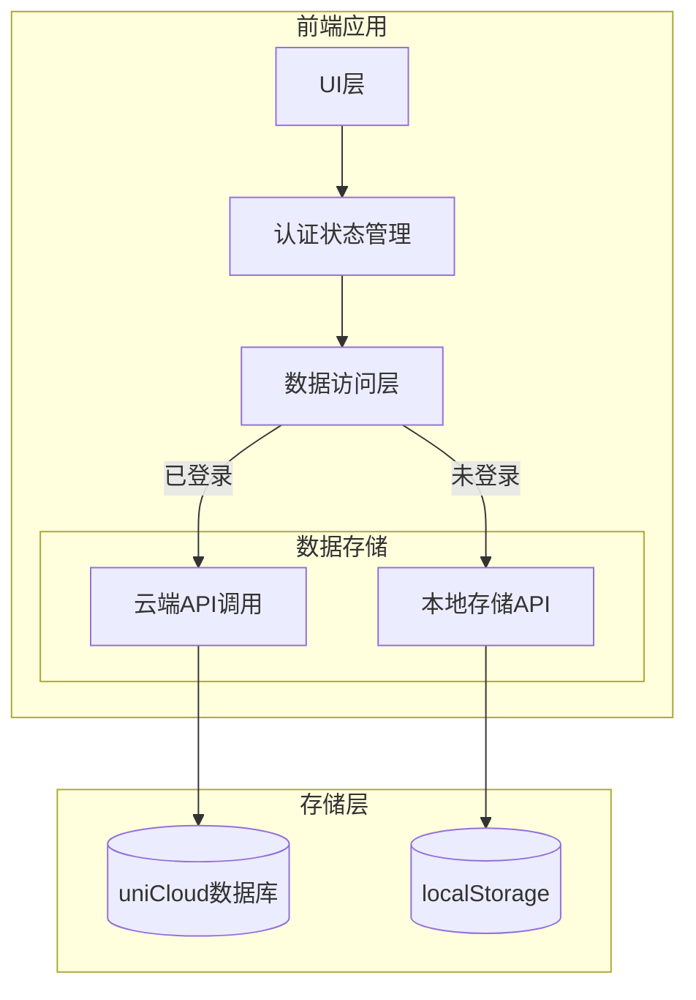

# Design Document - 离线访客模式

## Overview

本设计文档描述了离线访客模式功能的技术实现方案。该功能允许未登录用户在本地使用应用的核心功能，所有数据存储在浏览器本地，不与后端交互。系统需要能够区分登录用户和访客用户，并根据用户状态提供不同的功能访问权限和数据存储策略。

## Architecture

### 系统架构图



### 核心设计原则

1. **统一的数据访问接口**：通过数据访问层抽象，上层业务逻辑不需要关心数据来源
2. **最小侵入性**：尽可能复用现有组件和逻辑，通过条件判断切换数据源
3. **数据隔离**：本地数据和云端数据完全隔离，避免数据混淆
4. **渐进式功能限制**：通过权限守卫限制访客用户访问高级功能

## Components and Interfaces

### 1. 认证状态管理模块

```javascript
// composables/useAuthState.js
export function useAuthState() {
  const isGuest = computed(() => !store.hasLogin)
  const userMode = computed(() => isGuest.value ? 'guest' : 'user')
  
  return {
    isGuest,
    userMode,
    checkFeatureAccess(feature) // 检查功能访问权限
  }
}
```

### 2. 本地存储管理器

```javascript
// store/localStorage.js
class LocalStorageManager {
  constructor() {
    this.STORAGE_KEY = 'guest_todobook_data'
    this.MAX_BOOKS = 1
  }
  
  // TodoBook相关操作
  async getTodoBooks()
  async createTodoBook(data)
  async updateTodoBook(id, data)
  async deleteTodoBook(id)
  
  // Task相关操作
  async getTasks(bookId)
  async createTask(bookId, data)
  async updateTask(taskId, data)
  async deleteTask(taskId)
}
```

### 3. 数据访问层适配器

```javascript
// composables/useDataAdapter.js
export function useDataAdapter() {
  const { isGuest } = useAuthState()
  const localStore = new LocalStorageManager()
  
  return {
    // 根据用户状态返回对应的数据操作方法
    getTodoBooks: isGuest.value 
      ? localStore.getTodoBooks 
      : cloudAPI.getTodoBooks,
    // ... 其他方法
  }
}
```

### 4. 功能访问守卫

```javascript
// utils/featureGuard.js
const GUEST_ALLOWED_FEATURES = [
  'view_todobook',
  'create_todobook', // 限制1个
  'manage_tasks',
  'view_profile'
]

const GUEST_BLOCKED_FEATURES = [
  'tag_management',
  'member_management',
  'share_management',
  'archive_management',
  'statistics',
  'task_comments'
]

export function checkFeatureAccess(feature, isGuest) {
  if (isGuest && GUEST_BLOCKED_FEATURES.includes(feature)) {
    return { allowed: false, message: '该功能需要登录才能使用' }
  }
  return { allowed: true }
}
```

### 5. UI组件改造

需要改造的主要组件：
- `pages/list/list.vue` - 首页TodoBook列表
- `pages/todobooks/detail.vue` - TodoBook详情页
- `pages/tasks/detail.vue` - 任务详情页
- `pages/ucenter/ucenter.vue` - 个人中心页
- `components/LoginPrompt.vue` - 新增登录提示组件

## Data Models

### 本地存储数据结构

```javascript
// localStorage数据结构
{
  "guest_todobook_data": {
    "version": "1.0.0",
    "lastModified": "2024-01-01T00:00:00.000Z",
    "todobooks": [
      {
        "_id": "local_book_xxxxx", // 本地ID前缀
        "name": "我的待办",
        "description": "",
        "color": "#4CAF50",
        "icon": "📝",
        "tags": [],
        "created_at": "2024-01-01T00:00:00.000Z",
        "updated_at": "2024-01-01T00:00:00.000Z",
        "tasks_count": 0,
        "completed_count": 0,
        "is_local": true // 标识本地数据
      }
    ],
    "tasks": [
      {
        "_id": "local_task_xxxxx",
        "todobook_id": "local_book_xxxxx",
        "title": "任务标题",
        "description": "",
        "status": "todo", // todo, in_progress, completed
        "priority": "medium", // low, medium, high, urgent
        "tags": [],
        "created_at": "2024-01-01T00:00:00.000Z",
        "updated_at": "2024-01-01T00:00:00.000Z",
        "parent_id": null,
        "children": [],
        "is_local": true
      }
    ]
  }
}
```

### ID生成策略

本地数据使用特定前缀的ID以区分云端数据：
- TodoBook: `local_book_${timestamp}_${random}`
- Task: `local_task_${timestamp}_${random}`

## Error Handling

### 存储容量处理

```javascript
// 检查localStorage可用空间
function checkStorageQuota() {
  try {
    const testKey = '__test_quota__'
    const testData = new Array(1024).join('a') // 1KB
    localStorage.setItem(testKey, testData)
    localStorage.removeItem(testKey)
    return true
  } catch (e) {
    if (e.name === 'QuotaExceededError') {
      return false
    }
    throw e
  }
}
```

### 错误提示策略

1. **存储空间不足**：提示用户清理本地数据或登录使用云端存储
2. **隐私模式限制**：提示用户在正常模式下使用或登录账号
3. **数据格式错误**：自动修复或重置本地数据
4. **功能限制提示**：使用统一的Modal组件展示登录引导

### 数据一致性保护

```javascript
// 事务性操作封装
async function transactionalUpdate(operations) {
  const backup = localStorage.getItem(STORAGE_KEY)
  try {
    for (const op of operations) {
      await op()
    }
  } catch (error) {
    // 回滚
    localStorage.setItem(STORAGE_KEY, backup)
    throw error
  }
}
```


## 实现步骤概览

1. **基础架构搭建**
   - 创建LocalStorageManager类
   - 实现认证状态管理
   - 创建数据适配器

2. **核心功能实现**
   - TodoBook本地CRUD
   - Task本地CRUD
   - 功能访问控制

3. **UI层改造**
   - 页面认证判断
   - 访客模式标识
   - 登录提示组件

4. **错误处理完善**
   - 存储容量检测
   - 错误恢复机制
   - 用户友好提示

5. **测试和优化**
   - 单元测试编写
   - 集成测试验证
   - 性能优化

设计文档看起来怎么样？如果可以，我们可以继续创建实施任务列表。