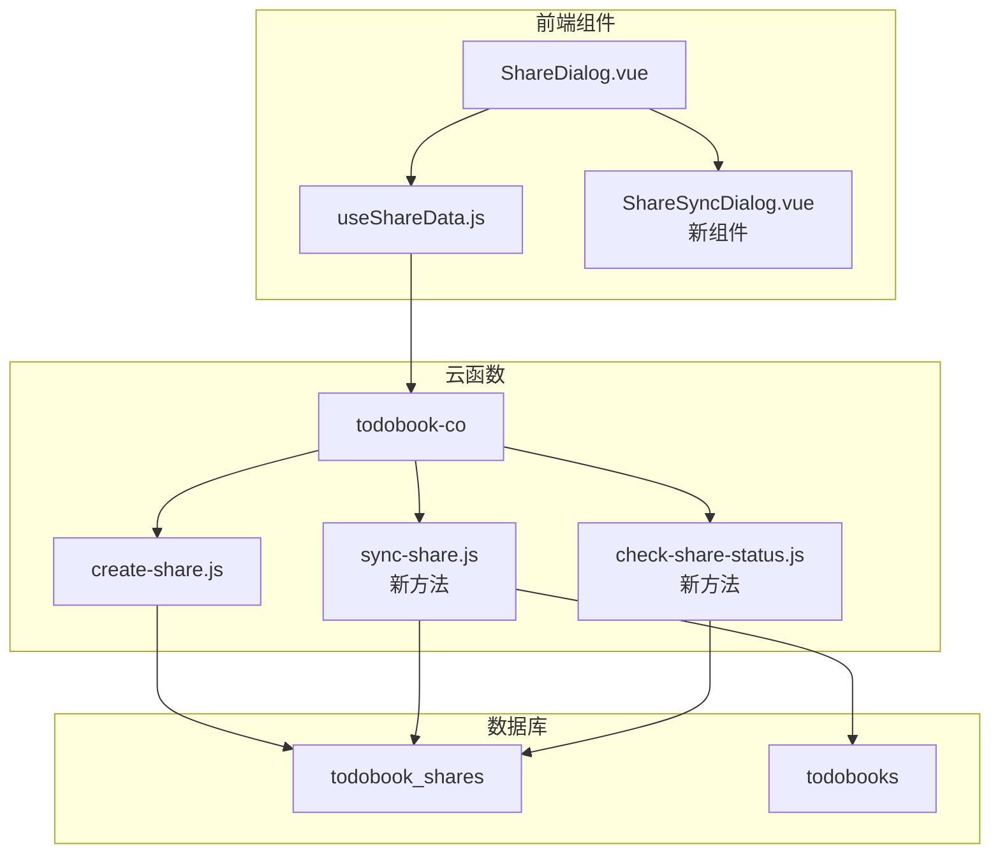

# Design Document

## Overview

本设计文档描述了如何改进项目册分享功能，支持已分享项目册的内容同步。当用户对已分享的项目册再次点击分享时，系统将提供同步最新内容到云端的选项，而不是简单地拒绝重复分享。该功能包含24小时同步频率限制，以避免过度同步。

## Architecture

### 系统架构概览



### 核心数据流

1. **分享状态检查流程**：
   - 用户点击分享按钮
   - 前端调用 `checkShareStatus` 检查项目册是否已分享
   - 如已分享，显示同步选项对话框
   - 如未分享，显示正常分享对话框

2. **同步流程**：
   - 用户选择同步
   - 系统检查上次同步时间
   - 如果符合条件，执行同步操作
   - 更新云端分享模板的内容
   - 记录同步时间戳

## Components and Interfaces

### 前端组件

#### 1. ShareDialog.vue 修改
- 在打开对话框前先检查分享状态
- 根据状态决定显示内容：
  - 未分享：显示正常分享界面
  - 已分享：显示同步选项界面

#### 2. ShareSyncDialog.vue (新组件)
- 显示已分享项目册的同步选项
- 展示上次同步时间
- 提供同步按钮（带24小时限制检查）
- 显示同步进度和结果

#### 3. useShareData.js 扩展
```javascript
// 新增方法
checkShareStatus(todoBookId) // 检查项目册分享状态
syncShare(shareId) // 同步分享内容
```

### 云函数接口

#### 1. checkShareStatus
```javascript
// 输入
{
  todoBookId: string // 项目册ID
}

// 输出
{
  code: 0,
  data: {
    isShared: boolean,
    shareInfo: {
      shareId: string,
      shareCode: string,
      lastSyncAt: Date,
      canSync: boolean,
      nextSyncTime: Date // 如果不能同步，显示下次可同步时间
    }
  }
}
```

#### 2. syncShare
```javascript
// 输入
{
  shareId: string // 分享记录ID
}

// 输出
{
  code: 0,
  message: '同步成功',
  data: {
    syncedAt: Date
  }
}
```

## Data Models

### todobook_shares 表扩展
```json
{
  // 现有字段...
  "last_sync_at": {
    "bsonType": "timestamp",
    "description": "最后同步时间",
    "title": "最后同步时间"
  },
  "sync_count": {
    "bsonType": "int",
    "minimum": 0,
    "default": 0,
    "description": "同步次数",
    "title": "同步次数"
  }
}
```

### 同步内容范围
同步操作将更新分享模板项目册的以下内容：
- 基本信息：标题、描述、图标、颜色
- 任务列表：所有任务及子任务的最新状态
- 标签信息：任务关联的标签
- 评论内容：如果初始分享包含评论，则同步评论

不会改变的内容：
- 分享码（保持稳定）
- 分享权限设置
- 分享模板ID
- 原始项目册ID引用

## Error Handling

### 错误场景处理

1. **同步频率限制**
   - 错误码：2001
   - 消息：显示剩余等待时间
   - 处理：在UI中显示倒计时

2. **项目册已删除**
   - 错误码：2002
   - 消息：原始项目册不存在
   - 处理：提示用户并建议删除分享

3. **权限错误**
   - 错误码：2003
   - 消息：无权限同步此分享
   - 处理：只有分享创建者可以同步

4. **同步失败**
   - 错误码：2004
   - 消息：同步过程中的技术错误
   - 处理：提示重试选项

### 前端错误处理
```javascript
try {
  const result = await syncShare(shareId)
  // 成功处理
} catch (error) {
  switch(error.code) {
    case 2001:
      // 显示时间限制提示
      showTimeLimitDialog(error.data.nextSyncTime)
      break
    case 2002:
      // 项目册不存在
      showDeletedBookDialog()
      break
    default:
      // 通用错误处理
      showErrorToast(error.message)
  }
}
```


## 设计决策说明

### 为什么选择24小时限制？
- 平衡用户需求和服务器负载
- 避免频繁同步造成的性能问题
- 给予用户足够的灵活性同时保护系统资源

### 为什么保持分享码不变？
- 用户体验连续性：已分享的链接继续有效
- 减少用户沟通成本：不需要重新发送分享码
- 系统简单性：避免复杂的分享码迁移逻辑

### 同步策略选择
- 全量同步而非增量：确保数据完整性，实现简单
- 保留原始引用：便于追踪和管理
- 异步处理：避免阻塞用户操作