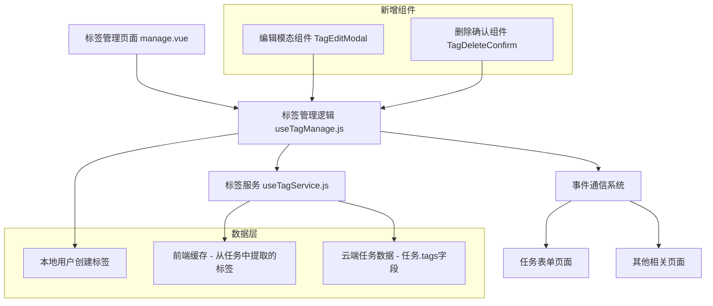

# Design Document

## Overview

基于现有的tag管理器架构，此设计方案将在原有页面基础上增加标签编辑和智能删除功能。设计充分利用现有的数据流、事件系统、UI组件模式，确保新功能无缝融入当前系统架构。主要包括：标签内联编辑模式、带依赖检查的智能删除、数据同步优化等功能。

## Architecture

### 系统架构图



### 数据流设计

**标签数据的实际存储位置：**
1. **用户创建的标签** - 存储在本地 `user_tags_${userId}`
2. **任务中的标签** - 存储在云端任务对象的 `tags` 字段中
3. **前端缓存** - `useTagService.js` 缓存从任务中提取的标签信息

**数据流程：**

1. **标签编辑流程**
   - 用户点击标签 → 进入编辑模式 → 显示编辑模态 → 保存修改 → 更新本地存储 → 清理前端缓存 → 通知相关页面刷新

2. **智能删除流程**
   - 用户点击删除 → 检查依赖关系（扫描项目册任务） → 显示删除确认 → 执行删除 → 从本地存储删除 → 清理前端缓存 → 通知刷新

**重要说明：**
- 标签的修改不会直接修改云端任务数据，而是通过标签管理页面的选择结果更新任务
- 当任务保存时，新的标签信息会同步到云端任务对象中
- `useTagService.js` 只负责前端缓存管理，不直接操作云端数据

## Components and Interfaces

### 新增组件

#### 1. TagEditModal 组件

**位置**: `/pages/tags/components/TagEditModal.vue`

**Props接口**:
```javascript
interface TagEditModalProps {
  visible: boolean;           // 控制模态显示/隐藏
  tag: TagItem | null;        // 被编辑的标签对象
  colorOptions: ColorOption[]; // 颜色选项列表
  availableTags: TagItem[];   // 现有标签列表（用于重名检查）
}
```

**Events接口**:
```javascript
interface TagEditModalEvents {
  'update:visible': (visible: boolean) => void;
  'confirm': (updatedTag: TagItem) => void;
  'cancel': () => void;
}
```

**内部状态**:
```javascript
interface EditFormData {
  name: string;     // 编辑中的标签名称
  color: string;    // 编辑中的标签颜色
}
```

#### 2. TagDeleteConfirm 组件

**位置**: `/pages/tags/components/TagDeleteConfirm.vue`

**Props接口**:
```javascript
interface TagDeleteConfirmProps {
  visible: boolean;           // 控制确认框显示/隐藏
  tag: TagItem | null;        // 要删除的标签
  dependencyCount: number;    // 依赖任务数量
  dependencyTasks?: string[]; // 依赖任务标题列表（可选）
}
```

**Events接口**:
```javascript
interface TagDeleteConfirmEvents {
  'update:visible': (visible: boolean) => void;
  'confirm': (tagId: string) => void;
  'cancel': () => void;
}
```

### 扩展现有接口

#### useTagManage.js 扩展

**新增响应式状态**:
```javascript
// 编辑相关状态
const isEditMode = ref(false)
const editingTag = ref(null)
const editModalVisible = ref(false)

// 删除确认相关状态
const deleteConfirmVisible = ref(false)
const deletingTag = ref(null)
const dependencyCount = ref(0)
```

**新增方法接口**:
```javascript
interface TagManageExtension {
  // 编辑功能
  startEditTag(tag: TagItem): void;
  cancelEditTag(): void;
  saveTagEdit(updatedTag: TagItem): Promise<void>;
  
  // 删除功能
  startDeleteTag(tag: TagItem): Promise<void>;
  confirmDeleteTag(tagId: string): Promise<void>;
  cancelDeleteTag(): void;
  
  // 依赖检查
  checkTagDependencies(tagId: string): Promise<number>;
  findDependentTasks(tagId: string): Promise<string[]>;
  
  // 缓存管理（标签修改后清理相关缓存）
  clearTagCaches(): void;
}
```

#### useTagService.js 扩展

**新增方法**:
```javascript
interface TagServiceExtension {
  // 依赖关系分析（扫描已缓存的任务数据）
  getTagUsageCount(bookId: string, tagId: string): Promise<number>;
  getTasksUsingTag(bookId: string, tagId: string): Promise<TaskItem[]>;
  
  // 缓存管理增强
  invalidateTagCache(bookId: string, tagId?: string): void;
  
  // 注意：不包含直接修改云端数据的方法
  // 标签修改通过任务表单保存时同步到云端
}
```

## Data Models

### 扩展 TagItem 数据模型

```javascript
interface TagItem {
  id: string;                 // 唯一标识
  name: string;               // 标签名称（1-5字符）
  color: string;              // 标签颜色（十六进制）
  createdAt: string;          // 创建时间（ISO字符串）
  updatedAt?: string;         // 更新时间（可选）
  source: 'local' | 'task' | 'current_task'; // 标签来源
  usageCount?: number;        // 使用次数（可选，用于UI显示）
}
```

### 操作日志数据模型

```javascript
interface TagOperation {
  type: 'create' | 'update' | 'delete';
  tagId: string;
  tagName: string;
  timestamp: string;
  bookId: string;
  userId: string;
  oldData?: Partial<TagItem>;  // 操作前数据（用于回滚）
  newData?: Partial<TagItem>;  // 操作后数据
}
```

## Error Handling

### 错误分类与处理策略

#### 1. 验证错误
```javascript
class TagValidationError extends Error {
  constructor(field: string, message: string) {
    super(`${field}: ${message}`)
    this.name = 'TagValidationError'
  }
}

// 处理策略：显示表单验证提示，不中断用户操作
```

#### 2. 数据冲突错误
```javascript
class TagConflictError extends Error {
  constructor(conflictType: 'name_exists' | 'concurrent_edit') {
    super(`Tag conflict: ${conflictType}`)
    this.name = 'TagConflictError'
  }
}

// 处理策略：显示冲突提示，提供解决选项
```

#### 3. 存储操作错误
```javascript
class TagStorageError extends Error {
  constructor(operation: string, cause?: Error) {
    super(`Storage operation failed: ${operation}`)
    this.name = 'TagStorageError'
    this.cause = cause
  }
}

// 处理策略：显示错误提示，提供重试选项，必要时回滚操作
```

### 错误恢复机制

1. **操作回滚**: 关键操作前备份数据，失败时自动回滚
2. **缓存重建**: 缓存损坏时从源数据重新构建
3. **数据修复**: 检测到数据不一致时提供修复功能

## Testing Strategy

### 单元测试

#### 1. useTagManage.js 测试覆盖
```javascript
describe('useTagManage - 编辑功能', () => {
  test('开始编辑标签时正确设置编辑状态')
  test('保存编辑时验证数据格式')
  test('处理重名冲突')
  test('编辑取消时恢复原始状态')
})

describe('useTagManage - 删除功能', () => {
  test('检查标签依赖关系')
  test('无依赖时直接删除')
  test('有依赖时显示确认对话框')
  test('删除后清理相关数据')
})
```

#### 2. TagService 扩展测试
```javascript
describe('TagService - 依赖分析', () => {
  test('正确统计标签使用次数')
  test('查找使用特定标签的任务')
  test('批量更新任务中的标签')
})
```

### 集成测试

#### 1. 端到端编辑流程测试
```javascript
describe('标签编辑完整流程', () => {
  test('从标签列表进入编辑模式')
  test('修改标签名称和颜色')
  test('保存后数据同步到所有相关任务')
  test('其他页面接收更新通知')
})
```

#### 2. 智能删除流程测试
```javascript
describe('智能删除完整流程', () => {
  test('删除无依赖标签的正常流程')
  test('删除有依赖标签的警告流程')
  test('确认删除后数据清理完整性')
})
```

### 用户界面测试

#### 1. 交互行为测试
- 标签编辑模态的显示/隐藏
- 颜色选择器的交互反馈
- 实时预览功能
- 删除确认对话框的依赖信息显示

#### 2. 响应式测试
- 不同屏幕尺寸下的组件布局
- 暗色模式下的视觉效果
- 长标签名称的处理

### 性能测试

#### 1. 数据处理性能
- 大量标签的渲染性能
- 依赖关系检查的响应时间
- 批量更新操作的效率

#### 2. 缓存效果测试
- 缓存命中率统计
- 缓存失效后的重建速度
- 内存使用情况

## Implementation Considerations

### 1. 向后兼容性
- 保持现有API接口不变
- 新功能采用渐进增强方式
- 支持旧版本标签数据格式

### 2. 性能优化
- 延迟加载依赖检查逻辑
- 批量更新任务标签时使用事务
- 合理使用缓存减少重复计算

### 3. 用户体验
- 编辑操作提供实时预览
- 删除操作显示详细影响信息
- 操作结果提供明确反馈

### 4. 数据一致性
- 关键操作使用乐观锁机制
- 定期检查数据完整性
- 提供数据修复工具