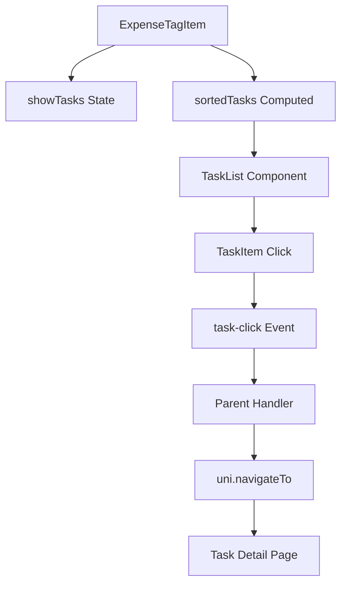

# Design Document

## Overview

该功能设计通过增强ExpenseTagItem组件，为统计页面饼图下方的tag列表添加展开/收起功能。用户点击tag项时，会在下方展开显示该tag下的所有相关任务，任务按actual_cost倒序排列。用户可以进一步点击具体任务跳转到任务详情页面。

设计重点关注用户体验的平滑性，包括动画效果、响应式布局和交互反馈，确保在各种设备和场景下都能提供一致的体验。

## Architecture

### 组件层次结构
```
ExpenseTagList (现有)
├── ExpenseTagItem (增强)
    ├── TagHeader (tag基本信息显示)
    ├── TaskList (新增 - 可展开的任务列表)
    │   ├── TaskListHeader (任务列表标题)
    │   └── TaskItem[] (任务项数组)
    └── ExpandIcon (展开/收起指示器)
```

### 数据流


## Components and Interfaces

### ExpenseTagItem 组件增强

#### 新增Props
```typescript
interface ExpenseTagItemProps {
  item: {
    tagId: string
    tagName: string
    amount: number
    count: number
    percentage: number
    color: string
    tasks: Task[] // 现有数据结构中已包含
  }
  index: number
  selected: boolean
}
```

#### 新增Events
```typescript
interface ExpenseTagItemEvents {
  'click': (item: TagItem) => void // 现有
  'task-click': (task: Task) => void // 新增
}
```

#### 新增State
```typescript
interface ExpenseTagItemState {
  showTasks: boolean // 控制任务列表展开/收起
}
```

#### 新增Computed
```typescript
interface ExpenseTagItemComputed {
  sortedTasks: Task[] // 按actual_cost倒序排列的任务
}
```

### Task数据结构
根据现有代码分析，Task对象包含以下关键字段：
```typescript
interface Task {
  _id: string
  title: string
  actual_cost?: number
  todobook_id: string
  [key: string]: any
}
```

## Data Models

### 展开状态管理
每个ExpenseTagItem维护独立的展开状态，不依赖全局状态：

```typescript
// 组件内部状态
const showTasks = ref(false)

// 任务排序逻辑
const sortedTasks = computed(() => {
  if (!props.item.tasks) return []
  return [...props.item.tasks].sort((a, b) => {
    const aCost = a.actual_cost || 0
    const bCost = b.actual_cost || 0
    return bCost - aCost
  })
})
```

### 导航参数
跳转到任务详情时传递的参数：
```typescript
interface TaskNavigationParams {
  id: string // task._id
  todobook_id: string // task.todobook_id
}
```

## UI/UX Design

### 视觉设计
1. **展开指示器**: 使用向下箭头(▼)，展开时旋转180度
2. **任务列表容器**: 
   - 背景色: rgba(248, 249, 250, 0.8)
   - 圆角: 底部12px圆角，与tag项形成连续视觉
   - 边框: 1px solid #e9ecef，顶部无边框
3. **任务项样式**:
   - 背景: #fff
   - 圆角: 8px
   - 间距: 8px padding，6px margin-bottom
   - 悬停效果: 背景变为#f8f9fa，边框变为#007aff

### 动画设计
1. **展开/收起动画**:
   - 属性: max-height + padding
   - 时长: 300ms
   - 缓动: ease
   - 展开: max-height: 0 → 300px
   - 收起: max-height: 300px → 0

2. **箭头旋转动画**:
   - 属性: transform: rotate()
   - 时长: 300ms
   - 缓动: ease
   - 角度: 0deg ↔ 180deg

### 响应式设计
- **移动端适配**:
  - 任务列表最大高度: 250px (小于480px屏幕)
  - 任务项padding: 6px 10px
  - 字体大小: title 13px, cost 12px
- **暗色主题支持**:
  - 任务列表背景: rgba(28, 28, 30, 0.8)
  - 任务项背景: #2c2c2e
  - 文字颜色: #fff

## Error Handling

### 场景1: 任务数据缺失
```javascript
// 防护措施
const sortedTasks = computed(() => {
  if (!props.item.tasks || !Array.isArray(props.item.tasks)) {
    return []
  }
  return [...props.item.tasks].sort((a, b) => {
    const aCost = a.actual_cost || 0
    const bCost = b.actual_cost || 0
    return bCost - aCost
  })
})
```

### 场景2: 导航参数缺失
```javascript
const handleTaskClick = (task) => {
  if (!task._id) {
    uni.showToast({
      title: '任务信息异常',
      icon: 'error'
    })
    return
  }
  
  if (!task.todobook_id) {
    uni.showToast({
      title: '无法获取项目信息',
      icon: 'error'
    })
    return
  }
  
  emit('task-click', task)
}
```

### 场景3: 页面跳转失败
```javascript
// 在父组件中处理
const handleTaskClick = (task) => {
  try {
    uni.navigateTo({
      url: `/pages/tasks/detail?id=${task._id}&todobook_id=${task.todobook_id}`,
      fail: (err) => {
        console.error('导航失败:', err)
        uni.showToast({
          title: '页面跳转失败',
          icon: 'error'
        })
      }
    })
  } catch (error) {
    console.error('导航异常:', error)
    uni.showToast({
      title: '系统错误',
      icon: 'error'
    })
  }
}
```

## Implementation Notes

### 技术约束
1. **uni-app兼容性**: 确保所有语法和API在uni-app环境下正常工作
2. **Vue 3 Composition API**: 使用`<script setup>`语法
3. **响应式系统**: 利用Vue 3的响应式特性管理状态
4. **跨平台兼容性**: 
   - **Android端**: 确保触摸事件、动画效果在Android设备上正常工作
   - **微信小程序**: 遵循微信小程序的组件和API限制，使用小程序兼容的事件处理方式

### 现有代码集成点
1. **ExpenseTagList组件**: 需要监听新增的task-click事件
2. **统计页面**: 需要处理任务跳转逻辑
3. **样式系统**: 复用现有的SCSS变量和mixins

### 性能优化考虑
1. **任务列表虚拟化**: 如果单个tag下任务数量过多，考虑实现虚拟滚动
2. **事件防抖**: 防止用户快速点击导致的异常行为
3. **内存管理**: 确保组件销毁时正确清理事件监听器

### 跨平台兼容性实现

#### Android端兼容性
1. **触摸事件处理**:
   ```javascript
   // 使用uni-app标准的@tap事件，确保Android触摸响应
   @tap="handleClick"
   // 避免使用@click，在某些Android设备可能存在延迟
   ```

2. **动画性能优化**:
   ```css
   /* 启用硬件加速，提升Android动画性能 */
   .task-list {
     transform: translateZ(0);
     backface-visibility: hidden;
     transition: max-height 0.3s ease;
   }
   ```

3. **样式兼容性**:
   ```css
   /* Android端box-shadow可能需要降级处理 */
   .task-item {
     box-shadow: 0 2px 8px rgba(0, 0, 0, 0.06);
     /* 对于低端Android设备，可以使用border替代 */
   }
   ```

#### 微信小程序兼容性
1. **事件处理限制**:
   ```javascript
   // 微信小程序中需要注意事件冒泡处理
   const handleTaskClick = (task) => {
     // 阻止事件冒泡，避免触发父级展开/收起
     event.stopPropagation?.()
     emit('task-click', task)
   }
   ```

2. **样式限制适配**:
   ```css
   /* 微信小程序不支持某些CSS属性，需要降级方案 */
   .expand-icon {
     /* 使用transform替代复杂动画 */
     transform: rotate(0deg);
     transition: transform 0.3s ease;
   }
   
   .expand-icon.rotated {
     transform: rotate(180deg);
   }
   ```

3. **组件层级限制**:
   ```javascript
   // 微信小程序对组件嵌套深度有限制，优化DOM结构
   // 避免过深的嵌套，保持扁平化结构
   ```

#### 统一兼容性处理
1. **平台检测**:
   ```javascript
   // 获取当前运行平台
   const platform = uni.getSystemInfoSync().platform
   const isMP = process.env.VUE_APP_PLATFORM === 'mp-weixin'
   const isAndroid = platform === 'android'
   ```

2. **条件渲染**:
   ```javascript
   // 根据平台提供不同的交互方式
   const clickDelay = computed(() => {
     return isAndroid ? 100 : 0 // Android端添加轻微延迟优化体验
   })
   ```