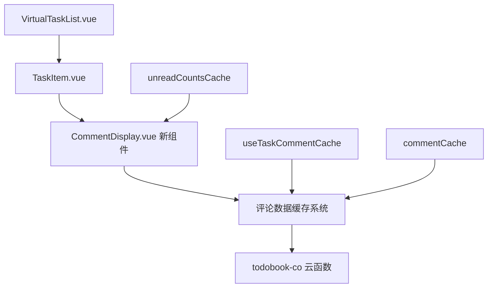

# Design Document - 任务评论显示改进功能

## Overview

本设计旨在改进TodoBook详情页面中任务评论的显示方式，将当前的"未读消息有n条"提示改进为：1) 常驻显示评论总数；2) 使用简洁的红点提示未读状态。该设计基于现有的VirtualTaskList组件和评论系统，通过优化数据结构和UI组件来实现需求。

## Architecture

### 整体架构概述



### 数据流架构

1. **数据获取层**：云函数接口提供评论数据和统计信息
2. **缓存管理层**：现有的LRU缓存系统和新增的统计缓存
3. **组件渲染层**：新的CommentDisplay组件负责评论信息的展示
4. **状态管理层**：本地存储用户阅读状态

## Components and Interfaces

### 1. 新增组件：CommentDisplay.vue

**功能**：专门负责任务评论信息的显示

**Props接口**：
```typescript
interface CommentDisplayProps {
  taskId: string           // 任务ID
  commentCount: number     // 评论总数
  hasUnread: boolean      // 是否有未读评论
  variant: 'card' | 'item' // 显示变体
  size: 'normal' | 'small' // 尺寸规格
}
```

**模板结构**：
```vue
<template>
  <view v-if="commentCount > 0" class="comment-display" :class="[
    `comment-display--${variant}`,
    `comment-display--${size}`,
    { 'comment-display--has-unread': hasUnread }
  ]">
    <!-- 评论图标 -->
    <uni-icons 
      :color="iconColor" 
      :size="iconSize" 
      type="chatbubble" 
    />
    
    <!-- 评论数量文本 -->
    <text class="comment-count">{{ commentCount }}条评论</text>
    
    <!-- 未读红点提示 -->
    <view v-if="hasUnread" class="unread-dot"></view>
  </view>
</template>
```

### 2. 修改组件：TaskItem.vue

**变更内容**：
- 移除现有的comment-hint相关代码
- 在适当位置引入CommentDisplay组件
- 传递必要的props数据

**集成位置**：
- Card模式：在task-meta区域替换原有的comment-hint
- Item模式：在task-content区域替换原有的comment-hint

### 3. 增强VirtualTaskList.vue

**新增数据结构**：
```javascript
// 评论统计缓存
const commentStatsCache = ref({})

// 评论统计计算
const commentStatsMap = computed(() => {
  const result = {}
  
  visibleTasks.value.forEach(task => {
    const taskId = task._id
    const cached = commentStatsCache.value[taskId]
    
    result[taskId] = {
      total: cached?.total || 0,
      hasUnread: cached?.hasUnread || false
    }
  })
  
  return result
})
```

## Data Models

### 1. 评论统计数据模型

```typescript
interface CommentStats {
  taskId: string      // 任务ID
  total: number       // 评论总数
  hasUnread: boolean  // 是否有未读
  lastUpdated: number // 最后更新时间戳
}

interface CommentStatsCache {
  [taskId: string]: CommentStats
}
```

### 2. 本地评论统计计算

**基于现有数据的统计逻辑**：

```typescript
interface CommentStatsCalculator {
  // 计算评论总数（包含回复）
  calculateTotal(comments: Comment[]): number
  
  // 计算是否有未读评论
  calculateHasUnread(comments: Comment[], lastViewTime: number, currentUserId: string): boolean
}
```

**统计实现逻辑**：
1. 基于现有的评论缓存数据进行本地计算
2. 遍历评论数组统计总数（包含回复）
3. 根据用户最后查看时间和评论创建时间判断未读状态
4. 排除用户自己的评论和已删除的评论

### 3. 本地缓存数据结构

```typescript
interface CommentViewRecord {
  [taskId: string]: number  // 任务ID -> 最后查看时间戳
}

// 存储在uni.storage中的键名
const COMMENT_VIEW_RECORDS_KEY = 'comment_view_records'
```

## Error Handling

### 1. 网络请求错误处理

```javascript
async function loadCommentStats(taskIds) {
  try {
    const result = await uniCloud.callFunction({
      name: 'todobook-co',
      data: {
        action: 'getTaskCommentStats',
        taskIds
      }
    })
    return result.result
  } catch (error) {
    console.error('加载评论统计失败:', error)
    // 返回默认数据，不阻塞UI渲染
    return {
      success: true,
      data: taskIds.map(id => ({
        taskId: id,
        total: 0,
        hasUnread: false
      }))
    }
  }
}
```

### 2. 数据异常处理

- **缺失数据**：使用默认值（total: 0, hasUnread: false）
- **过期缓存**：设置缓存过期时间，自动清理过期数据
- **存储异常**：使用try-catch包装存储操作，失败时不影响功能

### 3. UI容错设计

- 当评论数据加载失败时，显示默认状态
- 评论数量为0时，隐藏整个CommentDisplay组件
- 网络异常时，保持上次缓存的显示状态

## Testing Strategy

### 1. 单元测试

**CommentDisplay组件测试**：
- Props传递正确性验证
- 不同variant和size的渲染测试
- 未读状态的视觉提示测试
- 边界条件测试（commentCount = 0, 1, 大数值）

**数据处理函数测试**：
- commentStatsMap计算逻辑测试
- 缓存更新机制测试
- 错误处理逻辑测试

### 2. 集成测试

**VirtualTaskList集成测试**：
- 评论统计数据与TaskItem的正确传递
- 虚拟滚动时的数据更新测试
- 缓存命中与网络请求的协调测试

**云函数接口测试**：
- getTaskCommentStats接口的功能测试
- 批量获取的性能测试
- 权限控制测试

### 3. 端到端测试

**用户交互测试**：
- 任务列表中评论信息的正确显示
- 查看评论后未读状态的更新
- 添加新评论后数量的实时更新
- 不同屏幕尺寸下的显示效果

**性能测试**：
- 大量任务时的渲染性能
- 评论数据加载的响应时间
- 内存使用情况监控

### 4. 测试数据准备

```javascript
// 测试用例数据结构
const testCases = [
  {
    name: '无评论任务',
    data: { taskId: 'task1', commentCount: 0, hasUnread: false }
  },
  {
    name: '有评论无未读',
    data: { taskId: 'task2', commentCount: 5, hasUnread: false }
  },
  {
    name: '有评论有未读',
    data: { taskId: 'task3', commentCount: 3, hasUnread: true }
  },
  {
    name: '大量评论',
    data: { taskId: 'task4', commentCount: 99, hasUnread: true }
  }
]
```

## Implementation Approach

### 阶段1：基础组件开发
1. 创建CommentDisplay组件
2. 实现基础的props接口和样式
3. 单元测试验证

### 阶段2：数据接口扩展
1. 在云函数中实现getTaskCommentStats接口
2. 测试接口功能和性能
3. 权限控制验证

### 阶段3：缓存系统集成
1. 在VirtualTaskList中集成评论统计缓存
2. 实现批量加载和智能更新机制
3. 测试缓存命中率和更新逻辑

### 阶段4：UI集成和优化
1. 在TaskItem中集成CommentDisplay组件
2. 移除旧的评论提示代码
3. 样式调优和响应式适配

### 阶段5：测试和优化
1. 端到端功能测试
2. 性能优化和内存管理
3. 用户体验优化