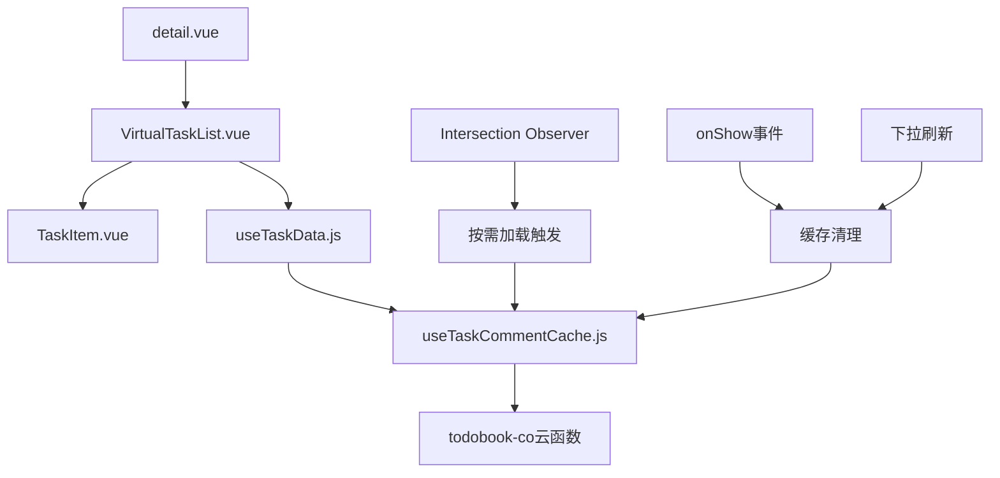

# 技术方案设计

## 架构概述

基于当前uni-app + Vue 3 + uniCloud的技术栈，采用组合式函数模式实现任务评论的按需加载和缓存机制。通过修改现有的`useTaskData`组合式函数和`VirtualTaskList`组件，在保持现有架构不变的前提下实现性能优化。

## 技术架构

### 1. 核心组件架构



### 2. 数据流设计

**当前数据流：**
- 页面初始化 → `initializeTasks` → `loadTasksCommentCounts` → 一次性加载所有任务评论

**优化后数据流：**
- 页面初始化 → `initializeTasks` → 跳过评论加载
- TaskItem首次可见 → 触发评论加载 → 缓存评论数据 → 更新UI
- 重复访问 → 直接使用缓存数据

## 技术选型

### 1. 缓存管理
- **技术选择**：创建新的组合式函数 `useTaskCommentCache.js`
- **缓存策略**：内存缓存 + LRU策略（最多缓存100个任务的评论数据）
- **数据结构**：Map对象存储，key为taskId，value为评论数据

### 2. 按需加载触发机制
- **技术选择**：利用现有的VirtualTaskList中的`watch(visibleTasks)`机制
- **触发条件**：任务从不可见变为可见时
- **加载策略**：异步加载，不阻塞UI渲染

### 3. 缓存清理机制
- **清理时机**：页面onShow事件、下拉刷新事件
- **清理方式**：清空内存缓存Map对象

## 接口设计

### 1. useTaskCommentCache 组合式函数接口

```javascript
// 输入参数
interface UseTaskCommentCacheOptions {
  maxCacheSize?: number // 最大缓存数量，默认100
}

// 返回接口
interface UseTaskCommentCacheReturn {
  // 状态
  loadingTasks: Ref<Set<string>> // 正在加载的任务ID集合
  
  // 方法
  getTaskComments: (taskId: string) => Promise<CommentData | null>
  getCachedComments: (taskId: string) => CommentData | null
  hasCached: (taskId: string) => boolean
  clearCache: () => void
  clearTaskCache: (taskId: string) => void
  
  // 新增：支持详情页的缓存操作
  addComment: (taskId: string, comment: Comment) => void
  updateComment: (taskId: string, commentId: string, data: any) => void
  deleteComment: (taskId: string, commentId: string) => void
  
  getCacheStats: () => { size: number, hits: number, misses: number }
}

// 评论数据结构
interface CommentData {
  comments: Array<Comment>
  total: number
  lastUpdated: number // 缓存时间戳
  isComplete: boolean // 是否已加载完整数据（用于详情页判断）
}
```

### 2. 修改后的 useTaskData 接口

```javascript
// 新增返回方法
interface UseTaskDataReturn {
  // ... 现有接口保持不变
  
  // 新增方法
  loadTaskComments: (taskId: string) => Promise<void>
  clearCommentCache: () => void
  getTaskUnreadCount: (taskId: string) => number
}
```

### 3. 修改后的 useTaskComments 接口（详情页优化）

```javascript
// 详情页组合式函数优化
interface UseTaskCommentsReturn {
  // ... 现有接口保持不变
  
  // 修改的方法
  loadComments: (taskId: string, refresh?: boolean, useCache?: boolean) => Promise<void>
  
  // 新增参数说明：
  // - refresh: 是否刷新数据，默认true
  // - useCache: 是否优先使用缓存，默认true
}
```

## 数据库设计

无需修改现有数据库结构，继续使用现有的云函数接口：
- `getTaskComments(taskId, page, pageSize)` - 获取任务评论数据

## 实现策略

### 1. 渐进式重构策略
1. **阶段1**：创建缓存组合式函数，不影响现有功能
2. **阶段2**：修改VirtualTaskList，集成按需加载逻辑，保持与现有`unreadCountsMap`接口兼容
3. **阶段3**：修改useTaskData，将批量加载改为可选（保留降级能力）
4. **阶段4**：添加缓存清理机制，确保数据同步到原有task对象结构

### 2. 性能优化策略
- **防抖处理**：短时间内多次请求同一任务评论时，只发起一次请求
- **并发控制**：限制同时加载的评论请求数量（最多5个并发）
- **错误重试**：网络错误时支持自动重试（最多3次）
- **详情页缓存复用**：详情页优先使用列表页缓存，减少50%以上的网络请求
- **智能缓存同步**：详情页评论操作实时同步到缓存，保持数据一致性

### 3. 错误处理策略
- **降级策略**：评论加载失败时不影响任务基本功能
- **用户提示**：加载失败时在控制台记录，但不显示用户提示
- **数据一致性**：确保缓存数据与服务端数据的一致性

## 测试策略

### 1. 单元测试
- 缓存组合式函数的各种场景测试
- 加载逻辑的边界条件测试
- 缓存清理机制测试

### 2. 集成测试
- VirtualTaskList与缓存系统的集成测试
- 页面生命周期与缓存管理的集成测试

### 3. 性能测试
- 页面初始化时间对比测试
- 内存使用情况监控
- 网络请求数量优化验证

## 兼容性设计

### 1. 原有评论显示功能兼容

**当前实现全面分析：**

**A. 任务列表页评论提醒功能：**
- TaskItem组件通过`unreadCommentCount` prop显示未读评论数量
- VirtualTaskList使用`unreadCountsMap[task._id]`映射传递未读数量  
- 依赖task对象的`task.comments`字段，通过`getUnreadCommentCount(task)`计算
- 数据来源：`initializeTasks` → `loadTasksCommentCounts` → 批量加载所有任务评论

**B. 任务详情页评论显示功能：**
- 位置：`pages/tasks/detail.vue`
- 组合式函数：`useTaskComments.js`
- 数据获取：直接调用云函数`getTaskComments(taskId, page, pageSize)`
- 功能：完整的CRUD操作、分页加载、已读标记等
- 独立数据流：不依赖从列表页传递的task.comments数据

**C. 关键数据依赖关系：**
```
列表页：task.comments (批量加载) → 计算未读数 → 显示提醒
详情页：独立调用云函数 → 获取最新评论 → 完整显示
```

**关键兼容性挑战：**
1. **数据同步**：按需加载的缓存数据必须同步到task.comments字段
2. **计算一致性**：确保缓存数据和原有数据的未读数计算结果一致
3. **详情页无影响**：详情页的独立数据流不受影响
4. **跨页面一致性**：列表页→详情页→列表页的数据保持一致

**完整兼容性策略：**
```javascript
// 1. 保持现有TaskItem接口完全不变
props: {
  unreadCommentCount: Number // 继续支持
}

// 2. VirtualTaskList中的智能兼容处理
const unreadCountsMap = computed(() => {
  const result = {}
  visibleTasks.value.forEach(task => {
    // 优先使用缓存的评论数据计算未读数
    if (commentCache.hasCached(task._id)) {
      const cachedData = commentCache.getCachedComments(task._id)
      // 确保task.comments字段同步
      task.comments = cachedData.comments
      task.comment_count = cachedData.total
      result[task._id] = calculateUnreadCount(task._id, cachedData.comments, currentUserId.value)
    } 
    // 回退到原有逻辑（如果任务已有评论数据）
    else if (task.comments) {
      result[task._id] = getUnreadCommentCount(task)
    }
    // 默认为0，触发异步加载
    else {
      result[task._id] = 0
      // 触发按需加载
      loadTaskCommentsAsync(task._id)
    }
  })
  return result
})

// 3. 按需加载完成后的数据同步
const syncCacheToTask = (taskId, commentData) => {
  const task = tasks.value.find(t => t._id === taskId)
  if (task) {
    // 关键：将缓存数据同步到原有的task结构
    task.comments = commentData.comments
    task.comment_count = commentData.total
  }
}
```

### 2. 数据结构兼容

**保持task对象结构：**
```javascript
// 现有task对象结构保持不变
task: {
  _id: string,
  title: string,
  // ... 其他属性
  comments?: Array<Comment>, // 可选，按需加载后填充
  comment_count?: number     // 可选，按需加载后填充
}
```

**缓存数据同步到task对象：**
```javascript
// 加载完评论后，同步到原有数据结构
const syncCommentsToTask = (taskId, commentData) => {
  const task = tasks.value.find(t => t._id === taskId)
  if (task) {
    task.comments = commentData.comments
    task.comment_count = commentData.total
  }
}
```

### 3. 详情页评论功能优化

**优化策略：详情页优先使用缓存**
- **智能缓存复用**：详情页优先检查并使用列表页已缓存的评论数据
- **避免重复请求**：如果缓存数据存在且新鲜，直接使用，无需重新请求后端
- **按需补充加载**：仅在缓存不存在或需要更多数据时才调用云函数
- **功能完整性**：评论CRUD、分页加载、已读标记等功能保持不变

**详情页数据获取逻辑优化：**
```javascript
// 修改 useTaskComments 中的 loadComments 方法
const loadComments = async (taskId, refresh = true) => {
  if (commentsLoading.value) return
  
  // 优先检查缓存
  const cachedData = commentCache.getCachedComments(taskId)
  if (cachedData && !refresh) {
    // 使用缓存数据，避免网络请求
    comments.value = cachedData.comments
    commentsData.total = cachedData.total
    commentsData.page = 1
    commentsData.pageSize = cachedData.comments.length
    commentsData.hasMore = cachedData.comments.length < cachedData.total
    
    // 自动标记为已读
    markTaskAsRead(taskId)
    return
  }
  
  // 缓存不存在或需要刷新时，才调用云函数
  commentsLoading.value = true
  // ... 原有的云函数调用逻辑
}
```

### 4. 跨页面数据一致性优化

**优化后的用户流程：**
```javascript
// 用户路径：列表页 → 详情页 → 返回列表页
// 1. 列表页：按需加载并缓存评论数据
// 2. 详情页：优先使用缓存数据（无网络请求）
// 3. 详情页操作：如有评论CRUD操作，同步更新缓存
// 4. 返回列表页：缓存已是最新状态，无需清理

// 缓存同步策略
const syncCacheOnCommentOperation = (taskId, operation, data) => {
  // 在详情页的评论操作完成后，同步更新缓存
  switch (operation) {
    case 'add':
      commentCache.addComment(taskId, data)
      break
    case 'update':
      commentCache.updateComment(taskId, data.commentId, data)
      break
    case 'delete':
      commentCache.deleteComment(taskId, data.commentId)
      break
  }
  
  // 同步更新task对象的comments字段
  syncCacheToTask(taskId, commentCache.getCachedComments(taskId))
}
```

**缓存失效机制：**
- **仅在必要时清理**：只在下拉刷新和页面onShow时清理全部缓存
- **操作时同步更新**：详情页的评论操作实时同步到缓存，避免数据不一致
- **智能判断**：区分用户主动刷新和正常导航，只在主动刷新时重新加载

### 5. 向后兼容策略

- **完全降级**：在缓存功能异常时，可完全回退到原有的批量加载逻辑
- **数据格式一致**：按需加载的数据与原有批量加载的数据格式100%一致  
- **接口零变更**：所有现有的组件接口和方法签名完全不变
- **功能无损失**：评论显示的所有现有功能都得到保留
- **多端兼容**：确保H5、小程序、APP端都能正常工作
