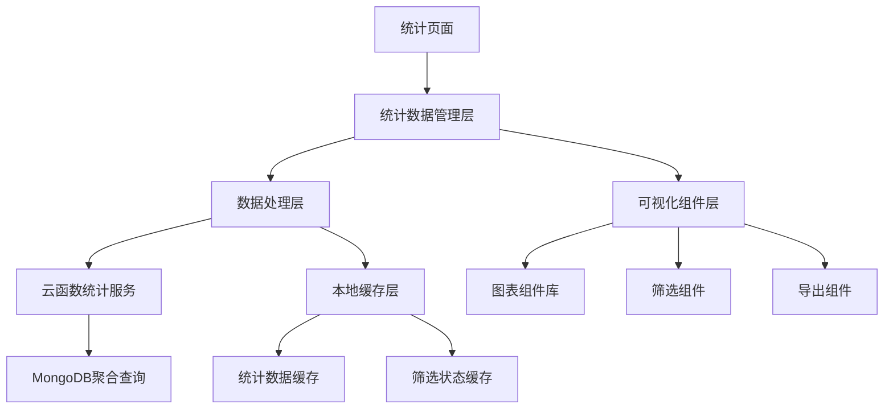

# 技术方案设计 - 优化任务信息的统计

## 总体架构设计

### 系统架构图



### 核心模块设计

#### 1. 统计数据管理层 (`useStatisticsData.js`)
- **职责**：统一管理统计数据的获取、缓存、更新
- **核心功能**：
  - 统计数据的响应式状态管理
  - 数据获取和刷新逻辑
  - 筛选状态管理
  - 数据导出逻辑

#### 2. 数据处理层 (`statisticsCalculator.js`)
- **职责**：统计数据的计算和处理
- **核心功能**：
  - 各类统计指标计算
  - 数据清洗和异常处理
  - 趋势分析计算
  - 对比数据生成

#### 3. 可视化组件层
- **图表组件**：基于Canvas 2D实现轻量级图表
- **筛选组件**：提供统一的筛选交互界面
- **导出组件**：处理数据导出和分享功能

## 详细技术设计

### 1. 数据库设计优化

#### 统计查询优化
为提升统计查询性能，需要在云函数中使用MongoDB聚合管道：

```javascript
// 示例：任务状态统计聚合查询
const statsAggregation = [
  {
    $match: {
      todobook_id: todoBooksId,
      deleted_at: { $exists: false }
    }
  },
  {
    $group: {
      _id: "$status",
      count: { $sum: 1 },
      totalEstimatedHours: { $sum: "$estimated_hours" },
      totalActualHours: { $sum: "$actual_hours" }
    }
  },
  {
    $group: {
      _id: null,
      statusStats: {
        $push: {
          status: "$_id",
          count: "$count",
          estimatedHours: "$totalEstimatedHours",
          actualHours: "$totalActualHours"
        }
      },
      totalTasks: { $sum: "$count" }
    }
  }
]
```

#### 时序数据索引
创建复合索引提升时间范围查询性能：

```javascript
// 建议的索引结构
{
  "todobook_id": 1,
  "completed_at": 1,
  "status": 1
}
```

### 2. 前端架构设计

#### 统计数据状态管理

```javascript
// useStatisticsData.js 核心结构
export function useStatisticsData() {
  // 响应式数据状态
  const statisticsState = reactive({
    // 基础统计数据
    overview: {
      total: 0,
      completed: 0,
      inProgress: 0,
      todo: 0,
      completionRate: 0,
      // ... 其他指标
    },
    
    // 趋势数据
    trends: {
      completionTrend: [], // 完成趋势
      creationTrend: [],   // 创建趋势
      efficiencyTrend: []  // 效率趋势
    },
    
    // 筛选状态
    filters: {
      timeRange: '30d',
      priority: 'all',
      tags: [],
      members: []
    },
    
    // 加载状态
    loading: {
      overview: false,
      trends: false,
      charts: false
    }
  })
  
  // 核心方法
  return {
    statisticsState,
    loadStatistics,
    refreshStatistics,
    updateFilters,
    exportStatistics
  }
}
```

#### 组件层次结构

```
StatisticsPage.vue
├── StatisticsHeader.vue (页面标题和基础信息)
├── StatisticsFilters.vue (筛选控件)
├── StatisticsTabBar.vue (Tab切换)
└── StatisticsContent.vue
    ├── OverviewTab.vue
    │   ├── MetricsGrid.vue (核心指标网格)
    │   ├── StatusDistribution.vue (状态分布)
    │   └── EfficiencyMetrics.vue (效率指标)
    ├── TrendsTab.vue
    │   ├── CompletionTrendChart.vue (完成趋势图)
    │   ├── PriorityDistributionChart.vue (优先级分布)
    │   └── WorkHoursComparisonChart.vue (工时对比)
    └── CompareTab.vue
        ├── TimeComparisonChart.vue (时间对比)
        └── MemberComparisonTable.vue (成员对比)
```

### 3. 图表组件实现

#### 轻量级图表库选择
考虑到uni-app的跨平台兼容性和包体积限制，采用Canvas 2D实现自定义图表组件：

```vue
<!-- BaseChart.vue 基础图表组件 -->
<template>
  <canvas 
    :canvas-id="canvasId"
    class="chart-canvas"
    :style="canvasStyle"
    @touchstart="handleTouchStart"
    @touchmove="handleTouchMove"
    @touchend="handleTouchEnd"
  />
</template>

<script setup>
// 图表基础逻辑
const props = defineProps({
  type: String, // 'line', 'bar', 'pie', 'radar'
  data: Object,
  options: Object
})

// 图表渲染逻辑
const renderChart = (ctx, data, options) => {
  switch (props.type) {
    case 'line':
      return renderLineChart(ctx, data, options)
    case 'bar':
      return renderBarChart(ctx, data, options)
    case 'pie':
      return renderPieChart(ctx, data, options)
    case 'radar':
      return renderRadarChart(ctx, data, options)
  }
}
</script>
```

#### 图表交互实现
为图表添加点击、缩放、拖拽等交互功能：

```javascript
// 图表交互处理
const handleChartInteraction = (e, chartType, data) => {
  const touch = e.touches[0] || e.changedTouches[0]
  const rect = canvas.getBoundingClientRect()
  const x = touch.clientX - rect.left
  const y = touch.clientY - rect.top
  
  // 根据点击位置确定数据点
  const dataPoint = getDataPointFromPosition(x, y, chartType, data)
  
  if (dataPoint) {
    // 触发钻取事件
    emit('chart-drill-down', {
      type: chartType,
      dataPoint: dataPoint,
      filters: currentFilters.value
    })
  }
}
```

### 4. 性能优化策略

#### 数据计算优化
- **渐进式计算**：优先计算核心指标，次要指标异步计算
- **计算缓存**：对复杂计算结果进行缓存，避免重复计算
- **增量更新**：数据变更时只更新影响的统计指标

#### 渲染性能优化
- **虚拟列表**：大量数据展示使用虚拟滚动
- **图表懒加载**：非当前Tab的图表延迟渲染
- **防抖节流**：筛选操作使用防抖避免频繁请求

#### 内存优化
- **数据清理**：及时清理不再使用的统计数据
- **组件缓存**：使用keep-alive缓存统计组件
- **图片压缩**：导出图表时进行适当压缩

### 5. 云函数扩展

#### 新增统计云函数

```javascript
// statistics-co 云函数对象
const statisticsCo = {
  async getAdvancedStatistics(todoBooksId, filters = {}) {
    // 获取高级统计数据
    const pipeline = this.buildAggregationPipeline(todoBooksId, filters)
    return await this.executeAggregation(pipeline)
  },
  
  async getTrendAnalysis(todoBooksId, timeRange) {
    // 获取趋势分析数据
    return await this.calculateTrends(todoBooksId, timeRange)
  },
  
  async getComparisonData(todoBooksId, compareOptions) {
    // 获取对比数据
    return await this.calculateComparisons(todoBooksId, compareOptions)
  },
  
  buildAggregationPipeline(todoBooksId, filters) {
    // 构建聚合管道
    const pipeline = [
      { $match: this.buildMatchCondition(todoBooksId, filters) },
      // ... 其他聚合阶段
    ]
    return pipeline
  }
}
```

### 6. 数据导出设计

#### 导出数据结构

```javascript
const exportData = {
  meta: {
    title: '任务统计报告',
    generatedAt: new Date().toISOString(),
    todoBooksTitle: bookData.title,
    filters: currentFilters,
    totalTasks: overview.total
  },
  
  statistics: {
    overview: { /* 概览数据 */ },
    trends: { /* 趋势数据 */ },
    charts: [
      {
        type: 'pie',
        title: '任务状态分布',
        imageData: chartImageBase64
      }
      // ... 其他图表
    ]
  },
  
  taskDetails: [
    // 任务详细列表（可选）
  ]
}
```

#### 导出功能实现

```javascript
// 导出逻辑
const exportStatistics = async (format = 'json') => {
  try {
    // 1. 收集当前统计数据
    const data = collectExportData()
    
    // 2. 生成图表截图
    const chartImages = await captureChartImages()
    
    // 3. 组装导出数据
    const exportPayload = assembleExportData(data, chartImages)
    
    // 4. 根据格式处理
    switch (format) {
      case 'json':
        return await exportAsJSON(exportPayload)
      case 'image':
        return await exportAsImage(exportPayload)
      default:
        throw new Error('不支持的导出格式')
    }
  } catch (error) {
    console.error('导出失败:', error)
    throw error
  }
}
```

## 安全考虑

1. **数据访问控制**：确保用户只能访问自己有权限的项目册统计数据
2. **查询防护**：对聚合查询进行参数验证，防止恶意查询
3. **导出限制**：对导出功能进行频率限制，防止滥用
4. **数据脱敏**：导出数据时对敏感信息进行脱敏处理

## 兼容性方案

1. **平台适配**：确保在H5、微信小程序等平台的功能一致性
2. **降级策略**：在不支持Canvas的环境下提供备选展示方案
3. **版本兼容**：保持与现有统计接口的向后兼容

## 测试策略

1. **单元测试**：统计计算逻辑的单元测试覆盖
2. **集成测试**：统计数据流的端到端测试
3. **性能测试**：大数据量下的性能表现测试
4. **兼容性测试**：多平台功能一致性测试