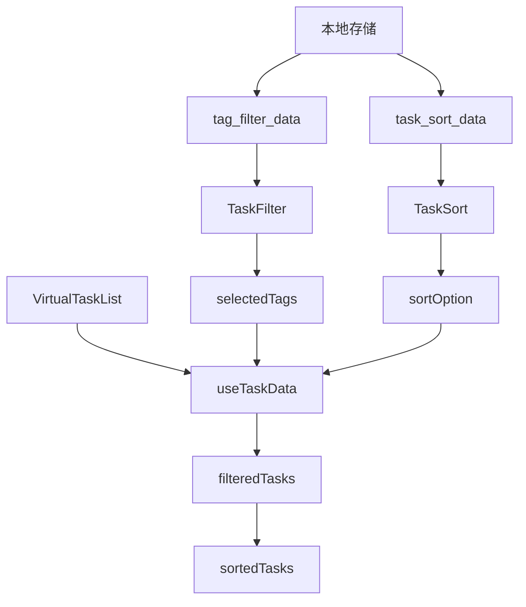

# Task Filter Sorting Design Document

## Overview

该设计文档描述了为任务过滤器增加排序功能的技术实现方案。基于现有TaskFilter组件架构，新增排序功能将通过独立的排序选择器组件实现，与现有过滤功能并行工作，支持本地存储和用户隔离。

## Architecture

### 整体架构设计

```
VirtualTaskList.vue
├── TaskFilter.vue (现有)
│   ├── 状态筛选标签 (all/todo/completed)
│   └── TagFilter弹窗组件
└── TaskSort.vue (新增)
    ├── 排序按钮触发器
    └── TaskSortPicker弹窗组件
```

### 数据流架构



## Components and Interfaces

### 1. TaskSort.vue 主组件

**职责：**
- 显示当前排序状态
- 提供排序按钮入口
- 管理TaskSortPicker弹窗显示状态

**接口设计：**
```vue
<template>
  <view class="task-sort">
    <view class="sort-trigger" @click="showSortPicker">
      <text class="sort-icon">📊</text>
      <text class="sort-text">{{ currentSortText }}</text>
      <text class="sort-arrow">▼</text>
    </view>
    
    <!-- 排序选择器弹窗 -->
    <TaskSortPicker
      v-if="showPicker"
      :visible="showPicker"
      :current-sort="currentSort"
      :todorbook-id="todorbookId"
      @confirm="handleSortConfirm"
      @cancel="handleSortCancel"
    />
  </view>
</template>

<script setup>
const props = defineProps({
  todorbookId: String,
  currentSort: {
    type: Object,
    default: () => ({ field: 'created_at', order: 'desc' })
  }
})

const emit = defineEmits(['sort-change'])
</script>
```

### 2. TaskSortPicker.vue 弹窗组件

**职责：**
- 提供排序选项选择界面
- 处理本地存储逻辑
- 用户隔离和数据持久化

**排序选项定义：**
```javascript
const sortOptions = [
  { 
    field: 'created_at', 
    order: 'desc', 
    label: '创建时间 (最新优先)',
    icon: '🕒'
  },
  { 
    field: 'created_at', 
    order: 'asc', 
    label: '创建时间 (最早优先)',
    icon: '🕒'
  },
  { 
    field: 'updated_at', 
    order: 'desc', 
    label: '更新时间 (最新优先)',
    icon: '🔄'
  },
  { 
    field: 'updated_at', 
    order: 'asc', 
    label: '更新时间 (最早优先)',
    icon: '🔄'
  },
  { 
    field: 'tags', 
    order: 'asc', 
    label: 'Tag类别 (A-Z)',
    icon: '🏷️'
  },
  { 
    field: 'tags', 
    order: 'desc', 
    label: 'Tag类别 (Z-A)',
    icon: '🏷️'
  }
]
```

### 3. useTaskData.js 扩展

**新增排序逻辑：**
```javascript
// 排序状态管理
const currentSort = ref({ field: 'created_at', order: 'desc' })

// 排序后的任务列表
const sortedTasks = computed(() => {
  return applySorting(filteredTasks.value, currentSort.value)
})

// 排序逻辑实现
function applySorting(tasks, sortOption) {
  if (!tasks || tasks.length === 0) return []
  
  const { field, order } = sortOption
  const sortedArray = [...tasks]
  
  switch (field) {
    case 'created_at':
    case 'updated_at':
      return sortByTime(sortedArray, field, order)
    case 'tags':
      return sortByTags(sortedArray, order)
    default:
      return sortedArray
  }
}
```

## Data Models

### 排序配置数据模型

```typescript
interface SortOption {
  field: 'created_at' | 'updated_at' | 'tags'
  order: 'asc' | 'desc'
}

interface SortStorage {
  sortOption: SortOption
  timestamp: number
}

interface TaskSortState {
  currentSort: SortOption
  isLoading: boolean
  showPicker: boolean
}
```

### 任务数据模型扩展

基于现有任务结构，排序功能将使用以下字段：

```typescript
interface Task {
  _id: string
  title: string
  created_at: number  // timestamp
  updated_at: number  // timestamp
  tags: (string | TagObject)[]
  status: 'todo' | 'in_progress' | 'completed' | 'cancelled'
  priority: 'low' | 'medium' | 'high' | 'urgent'
  // ... 其他字段
}

interface TagObject {
  id: string
  name: string
  color: string
}
```

## Error Handling

### 本地存储错误处理

```javascript
// 参考TagFilter的错误处理模式
const saveSortToLocal = (sortOption) => {
  try {
    const storageKey = getSortStorageKey()
    if (storageKey) {
      const sortData = {
        sortOption: sortOption,
        timestamp: Date.now()
      }
      uni.setStorageSync(storageKey, JSON.stringify(sortData))
      console.log('排序偏好已保存到本地:', storageKey, sortData)
    }
  } catch (error) {
    console.error('保存排序偏好失败:', error)
    // 回退到默认排序
    currentSort.value = { field: 'created_at', order: 'desc' }
  }
}

const loadSortFromLocal = () => {
  try {
    const storageKey = getSortStorageKey()
    if (storageKey) {
      const sortDataStr = uni.getStorageSync(storageKey)
      if (sortDataStr) {
        const sortData = JSON.parse(sortDataStr)
        return sortData.sortOption || getDefaultSort()
      }
    }
  } catch (error) {
    console.error('加载排序偏好失败:', error)
  }
  return getDefaultSort()
}
```

### 排序算法错误处理

```javascript
function sortByTags(tasks, order) {
  try {
    // 将任务按tag分组
    const tagGroups = new Map()
    const noTagTasks = []
    
    tasks.forEach(task => {
      const firstTag = getFirstTag(task)
      if (firstTag) {
        const tagName = typeof firstTag === 'object' ? firstTag.name : firstTag
        if (!tagGroups.has(tagName)) {
          tagGroups.set(tagName, [])
        }
        tagGroups.get(tagName).push(task)
      } else {
        noTagTasks.push(task)
      }
    })
    
    // 按tag名称排序
    const sortedTagNames = Array.from(tagGroups.keys()).sort((a, b) => {
      return order === 'asc' ? a.localeCompare(b) : b.localeCompare(a)
    })
    
    // 组装最终结果
    const result = []
    sortedTagNames.forEach(tagName => {
      const groupTasks = tagGroups.get(tagName)
      // 组内按创建时间降序排列
      groupTasks.sort((a, b) => new Date(b.created_at) - new Date(a.created_at))
      result.push(...groupTasks)
    })
    
    // 无tag任务放到最后
    noTagTasks.sort((a, b) => new Date(b.created_at) - new Date(a.created_at))
    result.push(...noTagTasks)
    
    return result
  } catch (error) {
    console.error('Tag排序失败:', error)
    return tasks // 返回原始任务列表
  }
}
```

## Testing Strategy

### 单元测试

**排序算法测试：**
```javascript
describe('Task Sorting', () => {
  test('应该按创建时间正确排序', () => {
    const tasks = [
      { created_at: 1000, title: 'Task 1' },
      { created_at: 2000, title: 'Task 2' },
      { created_at: 1500, title: 'Task 3' }
    ]
    
    const result = sortByTime(tasks, 'created_at', 'desc')
    expect(result[0].title).toBe('Task 2')
    expect(result[1].title).toBe('Task 3')
    expect(result[2].title).toBe('Task 1')
  })
  
  test('应该按Tag正确分组和排序', () => {
    const tasks = [
      { tags: ['工作'], title: 'Task 1', created_at: 1000 },
      { tags: ['生活'], title: 'Task 2', created_at: 2000 },
      { tags: ['工作'], title: 'Task 3', created_at: 1500 },
      { tags: [], title: 'Task 4', created_at: 3000 }
    ]
    
    const result = sortByTags(tasks, 'asc')
    // 验证分组逻辑
    expect(result[0].tags[0]).toBe('工作')
    expect(result[1].tags[0]).toBe('工作')
    expect(result[2].tags[0]).toBe('生活')
    expect(result[3].tags.length).toBe(0)
  })
})
```

**本地存储测试：**
```javascript
describe('Sort Local Storage', () => {
  test('应该正确保存排序偏好', () => {
    const sortOption = { field: 'updated_at', order: 'asc' }
    saveSortToLocal(sortOption)
    
    const loaded = loadSortFromLocal()
    expect(loaded.field).toBe('updated_at')
    expect(loaded.order).toBe('asc')
  })
  
  test('应该处理存储错误并回退到默认值', () => {
    // 模拟存储错误
    uni.getStorageSync = jest.fn().mockImplementation(() => {
      throw new Error('Storage error')
    })
    
    const loaded = loadSortFromLocal()
    expect(loaded).toEqual({ field: 'created_at', order: 'desc' })
  })
})
```

### 集成测试

**与过滤功能集成测试：**
```javascript
describe('Filter and Sort Integration', () => {
  test('应该先过滤后排序', () => {
    const tasks = createMockTasks()
    
    // 设置过滤条件：只显示todo状态
    setActiveFilter('todo')
    // 设置排序条件：按创建时间升序
    setSortOption({ field: 'created_at', order: 'asc' })
    
    const result = sortedTasks.value
    
    // 验证所有任务都是todo状态
    expect(result.every(task => task.status === 'todo')).toBe(true)
    // 验证排序正确
    expect(result[0].created_at <= result[1].created_at).toBe(true)
  })
})
```

### 用户体验测试

**性能测试：**
- 大量任务（1000+）的排序性能
- 排序切换的响应时间（<500ms要求）
- 内存使用优化

**兼容性测试：**
- 不同设备的存储兼容性
- 用户切换时的数据隔离
- 新老tag格式的兼容性

## Implementation Notes

### 集成到现有架构

1. **VirtualTaskList.vue 修改：**
   - 在TaskFilter旁边添加TaskSort组件
   - 修改固定头部高度计算
   - 传递todorbookId和排序状态

2. **useTaskData.js 扩展：**
   - 添加排序相关状态和方法
   - 修改最终任务列表计算逻辑
   - 保持与现有过滤逻辑的兼容性

3. **样式系统集成：**
   - 复用现有SCSS mixins
   - 保持与TaskFilter一致的视觉风格
   - 支持主题系统

### 性能优化

1. **计算缓存：**
   - 使用computed缓存排序结果
   - 避免不必要的重排序
   - 优化大数据量的处理

2. **异步处理：**
   - 超过一定数量时使用requestIdleCallback
   - 分批处理大量任务
   - 显示处理进度

### 扩展性考虑

1. **新排序字段：**
   - 优先级排序
   - 截止日期排序
   - 字母顺序排序

2. **高级排序：**
   - 多字段组合排序
   - 自定义排序规则
   - 排序模板保存