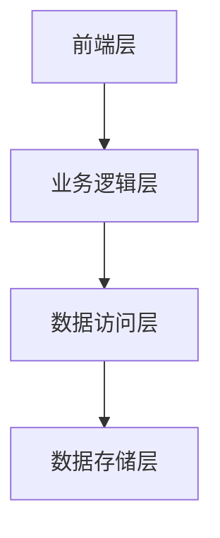
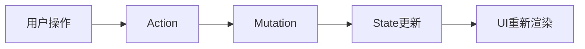

# 技术方案设计

## 方案概述

{简要描述技术解决方案}

## 系统架构

### 整体架构



### 技术栈

#### 前端技术
- **框架**: uni-app + Vue 3 Composition API
- **UI组件**: uni-ui
- **状态管理**: {具体方案}
- **样式处理**: SCSS + uni-scss

#### 后端技术
- **云平台**: uniCloud (阿里云版)
- **数据库**: MongoDB
- **云函数**: Node.js Cloud Objects
- **认证系统**: uni-id-common

## 数据库设计

### 数据表结构

#### {表名1}
```json
{
  "field1": "类型和说明",
  "field2": "类型和说明",
  "field3": "类型和说明"
}
```

#### {表名2}
```json
{
  "field1": "类型和说明",
  "field2": "类型和说明"
}
```

### 数据关系
- {表1} → {表2}: {关系说明}
- {表2} → {表3}: {关系说明}

## 接口设计

### Cloud Function API

#### {功能模块}
```javascript
// {接口名称}
// 参数: {参数说明}
// 返回: {返回值说明}
module.exports = {
  async methodName(params) {
    // 实现逻辑
  }
}
```

### 前端API调用
```javascript
// {调用示例}
const result = await uniCloud.callFunction({
  name: 'functionName',
  data: {
    // 参数
  }
})
```

## 核心功能实现

### {功能1}
- **实现方式**: {具体说明}
- **关键技术点**: {技术细节}
- **性能优化**: {优化方案}

### {功能2}
- **实现方式**: {具体说明}
- **关键技术点**: {技术细节}
- **注意事项**: {特别说明}

## 状态管理

### 状态结构
```javascript
const state = {
  // 状态定义
}
```

### 数据流


## 安全性设计

### 权限控制
- **认证机制**: {认证方式}
- **授权策略**: {授权规则}
- **数据权限**: {数据访问控制}

### 数据安全
- **输入验证**: {验证规则}
- **数据加密**: {加密方案}
- **敏感信息处理**: {处理方式}

## 性能优化

### 前端优化
- **代码分割**: {分割策略}
- **懒加载**: {懒加载方案}
- **缓存策略**: {缓存机制}

### 后端优化
- **数据库优化**: {索引设计、查询优化}
- **云函数优化**: {性能优化措施}

## 测试策略

### 单元测试
- **测试框架**: {测试工具}
- **覆盖范围**: {测试覆盖率要求}

### 集成测试
- **测试场景**: {主要测试场景}
- **测试数据**: {测试数据准备}

### 用户测试
- **测试环境**: {测试环境配置}
- **测试用例**: {关键测试用例}

## 部署方案

### 开发环境
- **本地开发**: {开发环境配置}
- **调试工具**: {调试方式}

### 生产环境
- **部署流程**: {部署步骤}
- **监控方案**: {监控配置}

## 风险评估

### 技术风险
- **风险点**: {潜在技术风险}
- **应对措施**: {风险缓解方案}

### 业务风险
- **风险点**: {潜在业务风险}
- **应对措施**: {风险缓解方案}