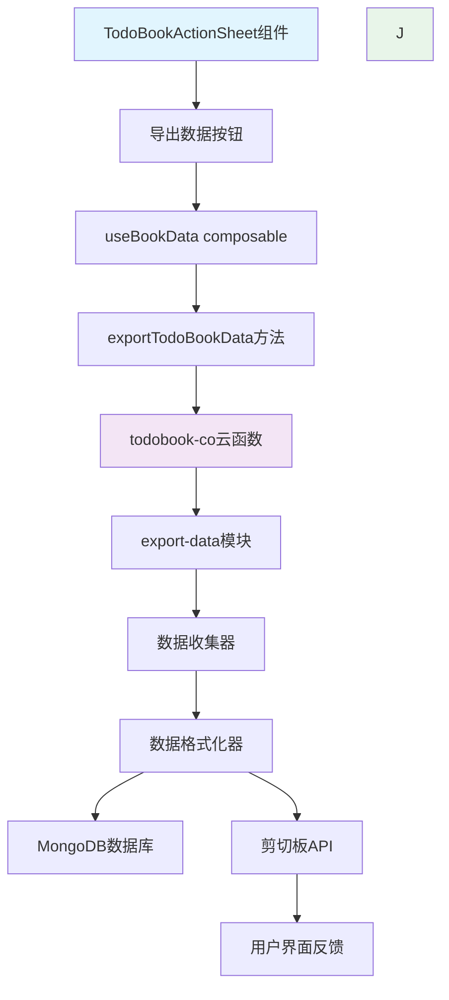
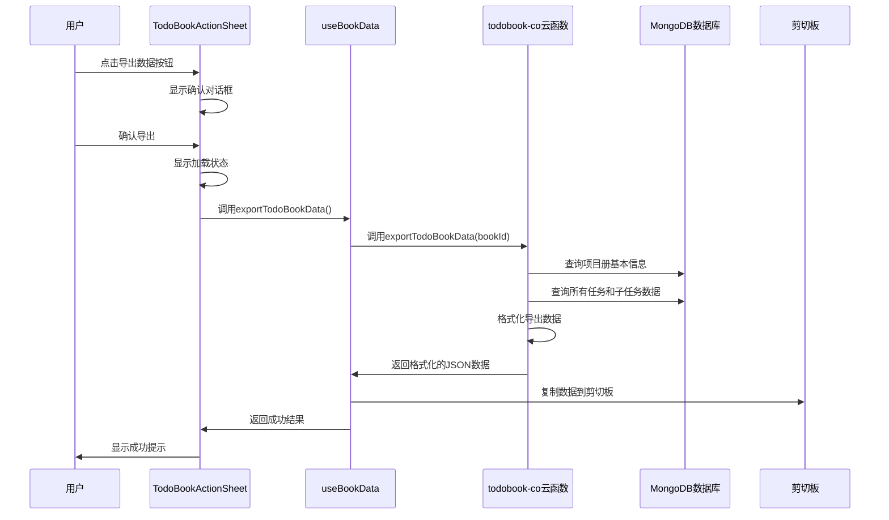

# Design Document - TodoBook数据导出功能

## Overview

本设计文档描述了在现有TodoBookActionSheet组件中集成数据导出功能的详细方案。该功能允许任何有访问权限的用户将完整的项目册数据（包括项目册信息、所有任务和子任务）按照数据库原始格式导出到剪切板，以支持数据迁移和备份需求。

设计方案遵循项目现有的架构模式：
- 前端使用Composition API和事件驱动架构
- 后端使用云函数模块化设计
- 数据访问通过composable函数封装
- 导出功能对所有有访问权限的用户开放

## Architecture

### 整体架构



### 数据流图



## Components and Interfaces

### 1. 前端组件设计

#### TodoBookActionSheet组件扩展

在现有的action-list中添加导出数据选项：

```vue
<!-- 在正常项目册的操作列表中添加 -->
<view class="action-item" @click="handleExportAction">
  <uni-icons color="#17a2b8" size="20" type="download" />
  <text class="action-text">导出数据</text>
</view>
```

显示控制：
- 所有有访问权限的用户都可见导出按钮
- 归档状态的项目册也支持导出

#### 新增交互方法

```javascript
const handleExportAction = async () => {
  close() // 关闭action sheet
  
  // 显示确认对话框
  uni.showModal({
    title: '导出数据',
    content: '将导出项目册的完整数据到剪切板，包括所有任务和子任务信息。确定要继续吗？',
    success: async (res) => {
      if (res.confirm) {
        await performExport()
      }
    }
  })
}

const performExport = async () => {
  try {
    uni.showLoading({ title: '正在导出数据...' })
    
    const result = await exportTodoBookData(props.bookData._id)
    
    uni.hideLoading()
    uni.showToast({
      title: '数据已复制到剪切板',
      icon: 'success'
    })
    
    emit('action-completed', { type: 'export', success: true })
  } catch (error) {
    uni.hideLoading()
    uni.showToast({
      title: error.message || '导出失败',
      icon: 'error'
    })
    emit('action-completed', { type: 'export', success: false, error })
  }
}
```

### 2. Composable函数扩展

#### useBookData.js扩展

```javascript
/**
 * 导出项目册完整数据
 * @param {string} bookId - 项目册ID
 * @returns {Promise<void>}
 */
const exportTodoBookData = async (bookId) => {
  try {
    const todoBookCo = uniCloud.importObject('todobook-co')
    const result = await todoBookCo.exportTodoBookData(bookId)
    
    if (result.code === 0) {
      // 格式化导出数据为易读的JSON
      const exportData = JSON.stringify(result.data, null, 2)
      
      // 复制到剪切板
      await uni.setClipboardData({
        data: exportData
      })
      
      console.log('数据导出成功，已复制到剪切板')
    } else {
      throw new Error(result.message)
    }
  } catch (error) {
    console.error('导出项目册数据失败:', error)
    throw error
  }
}
```

### 3. 云函数设计

#### 新增export-data模块

文件路径：`uniCloud-alipay/cloudfunctions/todobook-co/module/export/export-data.js`

```javascript
/**
 * 导出项目册完整数据
 * @param {string} bookId - 项目册ID
 * @returns {Object} 导出的完整数据
 */
async function exportTodoBookData(bookId) {
  const { uid, db } = this
  
  try {
    // 1. 并行获取所有相关数据
    const [bookResult, tasksResult] = await Promise.all([
      // 项目册基本信息
      db.collection('todobooks').doc(bookId).get(),
      // 所有任务数据
      db.collection('todoitems')
        .where({ todobook_id: bookId })
        .orderBy('sort_order', 'asc')
        .orderBy('created_at', 'desc')
        .get()
    ])
    
    // 2. 数据验证
    if (!bookResult.data.length) {
      return createErrorResponse(ERROR_CODES.NOT_FOUND, '项目册不存在')
    }
    
    // 3. 组织导出数据结构，包含所有数据库字段
    const exportData = {
      metadata: {
        exportVersion: '1.0.0',
        exportTime: new Date().toISOString(),
        exportBy: uid,
        dataType: 'todobook-full-export'
      },
      todobook: bookResult.data[0], // 包含所有项目册字段
      tasks: organizeTasks(tasksResult.data), // 包含所有任务字段，保持层级结构
      statistics: generateStatistics(tasksResult.data)
    }
    
    // 4. 记录导出操作日志
    await logExportOperation(uid, bookId)
    
    return createSuccessResponse(exportData)
  } catch (error) {
    console.error('导出项目册数据失败:', error)
    return createErrorResponse(ERROR_CODES.INTERNAL_ERROR, '导出数据失败')
  }
}
```

#### 操作日志记录函数

```javascript
/**
 * 记录导出操作日志
 * @param {string} uid - 用户ID
 * @param {string} bookId - 项目册ID
 */
async function logExportOperation(uid, bookId) {
  try {
    // 可以选择记录到日志表或者console
    console.log(`数据导出记录: 用户${uid}导出项目册${bookId}数据, 时间:${new Date().toISOString()}`)
    
    // 如果需要持久化日志，可以写入数据库
    // await db.collection('operation_logs').add({
    //   user_id: uid,
    //   todobook_id: bookId,
    //   operation: 'export_data',
    //   timestamp: new Date()
    // })
  } catch (error) {
    console.error('记录导出日志失败:', error)
    // 日志记录失败不影响导出功能
  }
}
```

#### 数据组织函数

```javascript
/**
 * 组织任务数据为层次结构，保留所有数据库字段
 * @param {Array} tasks - 原始任务数据
 * @returns {Array} 组织后的任务数据
 */
function organizeTasks(tasks) {
  const taskMap = new Map()
  const rootTasks = []
  
  // 构建任务映射，保留所有原始字段
  tasks.forEach(task => {
    taskMap.set(task._id, { ...task, subtasks: [] })
  })
  
  // 构建层次结构
  tasks.forEach(task => {
    if (task.parent_id && taskMap.has(task.parent_id)) {
      taskMap.get(task.parent_id).subtasks.push(taskMap.get(task._id))
    } else {
      rootTasks.push(taskMap.get(task._id))
    }
  })
  
  return rootTasks
}

/**
 * 生成统计信息
 * @param {Array} tasks - 任务数据
 * @returns {Object} 统计信息
 */
function generateStatistics(tasks) {
  const total = tasks.length
  const completed = tasks.filter(t => t.status === 'completed').length
  const inProgress = tasks.filter(t => t.status === 'in_progress').length
  const todo = tasks.filter(t => t.status === 'todo').length
  
  return {
    taskCounts: { total, completed, inProgress, todo },
    completionRate: total > 0 ? Math.round((completed / total) * 100) : 0,
    priorityDistribution: {
      urgent: tasks.filter(t => t.priority === 'urgent').length,
      high: tasks.filter(t => t.priority === 'high').length,
      medium: tasks.filter(t => t.priority === 'medium').length,
      low: tasks.filter(t => t.priority === 'low').length
    }
  }
}
```

## Data Models

### 导出数据结构

```json
{
  "metadata": {
    "exportVersion": "1.0.0",
    "exportTime": "2024-01-15T10:30:00.000Z",
    "exportBy": "user_id_123",
    "dataType": "todobook-full-export"
  },
  "todobook": {
    "_id": "todobook_id",
    "title": "项目册标题",
    "description": "项目册描述",
    "creator_id": "creator_user_id",
    "created_at": "2024-01-01T00:00:00.000Z",
    "updated_at": "2024-01-15T10:00:00.000Z",
    "color": "#007AFF",
    "icon": "folder",
    "is_shared": false,
    "share_type": "private",
    "member_count": 3,
    "item_count": 15,
    "completed_count": 8,
    "sort_order": 0,
    "is_archived": false,
    "archived_at": null,
    "last_activity_at": "2024-01-15T09:30:00.000Z",
    "is_share_template": false,
    "template_creator_id": null,
    "template_created_at": null,
    "imported_from_share_id": null
  },
  "tasks": [
    {
      "_id": "task_id_1",
      "todobook_id": "todobook_id",
      "parent_id": null,
      "title": "主要任务",
      "description": "任务描述",
      "creator_id": "creator_user_id",
      "assignee_id": "assignee_user_id",
      "created_at": "2024-01-02T00:00:00.000Z",
      "updated_at": "2024-01-10T15:00:00.000Z",
      "due_date": "2024-01-20T00:00:00.000Z",
      "completed_at": null,
      "status": "in_progress",
      "priority": "high",
      "tags": [
        {
          "id": "tag_001",
          "name": "重要",  
          "color": "#FF4757"
        }
      ],
      "sort_order": 1,
      "level": 0,
      "progress": 60,
      "estimated_hours": 8.5,
      "budget": 1000,
      "actual_cost": 600,
      "comments": [
        {
          "_id": "comment_id_1",
          "user_id": "user_id_456",
          "content": "进展顺利",
          "created_at": "2024-01-05T14:30:00.000Z",
          "updated_at": "2024-01-05T14:30:00.000Z",
          "reply_to": null,
          "is_deleted": false,
          "deleted_at": null
        }
      ],
      "subtask_count": 2,
      "completed_subtask_count": 1,
      "last_activity_at": "2024-01-10T15:00:00.000Z",
      "subtasks": [
        {
          "_id": "task_id_2",
          "todobook_id": "todobook_id",
          "parent_id": "task_id_1",
          "title": "子任务1",
          "description": "子任务描述",
          "creator_id": "creator_user_id",
          "assignee_id": "assignee_user_id",
          "created_at": "2024-01-03T00:00:00.000Z",
          "updated_at": "2024-01-08T12:00:00.000Z",
          "due_date": "2024-01-15T00:00:00.000Z",
          "completed_at": "2024-01-08T12:00:00.000Z",
          "status": "completed",
          "priority": "medium",
          "tags": [],
          "sort_order": 1,
          "level": 1,
          "progress": 100,
          "estimated_hours": 2.0,
          "budget": 200,
          "actual_cost": 150,
          "comments": [],
          "subtask_count": 0,
          "completed_subtask_count": 0,
          "last_activity_at": "2024-01-08T12:00:00.000Z",
          "subtasks": []
        }
      ]
    }
  ],
  "statistics": {
    "taskCounts": {
      "total": 15,
      "completed": 8,
      "inProgress": 4,
      "todo": 3
    },
    "completionRate": 53,
    "priorityDistribution": {
      "urgent": 2,
      "high": 5,
      "medium": 6,
      "low": 2
    }
  }
}
```

## Error Handling

### 错误类型和处理策略

1. **权限错误**
   - 错误码：`FORBIDDEN`
   - 场景：用户无权限访问项目册
   - 处理：显示权限不足提示

2. **数据不存在错误**
   - 错误码：`NOT_FOUND`
   - 场景：项目册不存在
   - 处理：显示项目册不存在提示

3. **网络错误**
   - 错误码：`NETWORK_ERROR`
   - 场景：网络连接失败
   - 处理：显示网络错误，建议重试

4. **剪切板错误**
   - 场景：剪切板API调用失败
   - 处理：显示复制失败提示，提供手动复制选项

5. **数据量过大错误**
   - 场景：导出数据超出限制
   - 处理：分批导出或压缩数据

### 错误处理实现

```javascript
// 前端错误处理
const handleExportError = (error) => {
  let title = '导出失败'
  let content = '请稍后重试'
  
  switch (error.code) {
    case 'FORBIDDEN':
      title = '权限不足'
      content = '无法访问项目册数据'
      break
    case 'NOT_FOUND':
      title = '项目册不存在'
      content = '请刷新页面后重试'
      break
    case 'NETWORK_ERROR':
      title = '网络连接失败'
      content = '请检查网络连接后重试'
      break
    case 'CLIPBOARD_ERROR':
      title = '复制到剪切板失败'
      content = '请手动复制数据'
      break
  }
  
  uni.showModal({
    title,
    content,
    showCancel: false
  })
}
```

## Testing Strategy

### 单元测试

1. **云函数测试**
   - 权限检查逻辑测试
   - 数据查询和格式化测试
   - 错误处理测试

2. **Composable函数测试**
   - 导出方法调用测试
   - 剪切板操作测试
   - 错误处理测试

3. **组件测试**
   - 按钮显示逻辑测试
   - 用户交互流程测试
   - 权限控制测试

### 集成测试

1. **完整导出流程测试**
   - 有权限用户导出测试
   - 无权限用户访问阻止测试
   - 归档项目册导出测试

2. **数据完整性测试**
   - 导出数据结构验证
   - 数据关联性验证
   - 统计信息准确性验证

3. **性能和边界测试**
   - 大数据量导出测试
   - 网络异常处理测试
   - 并发导出测试

### 用户验收测试

1. **功能完整性**
   - 导出按钮正确显示
   - 导出确认流程正确
   - 数据成功复制到剪切板

2. **用户体验**
   - 加载状态提示清晰
   - 成功/失败反馈及时
   - 错误信息易于理解

3. **数据准确性**
   - 导出数据与实际数据一致
   - 层次结构正确保持
   - 时间格式标准化