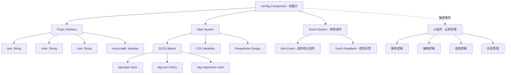

# 统一Tag组件设计文档

## Overview

本设计旨在创建一个可复用的Tag组件，用于替换项目中现有的不一致tag实现。该组件将提供统一的视觉效果、可配置的尺寸选项，并完全集成到项目现有的样式系统中。

### 核心目标
- 统一项目中所有tag的视觉效果
- 提供灵活的尺寸配置
- 保持与现有样式系统的一致性
- 支持渐进式替换现有实现
- **仅负责显示逻辑，业务交互由使用页面处理**

### 设计原则
- **一致性**: 所有tag使用相同的视觉语言
- **可配置性**: 支持不同尺寸和颜色
- **职责单一**: 只负责显示，不包含业务逻辑
- **事件透传**: 简单事件触发，具体处理由父组件决定
- **可访问性**: 确保良好的对比度和触摸体验
- **兼容性**: 与uni-app框架和项目样式系统兼容

## Architecture

### 组件架构



### 文件结构

```
pages/todobooks/components/common/
├── UniTag.vue                 # 主组件文件
└── README.md                  # 组件使用文档

pages/todobooks/styles/
├── mixins.scss               # 添加tag相关mixins
└── variables.scss            # 添加tag相关变量
```

### 组件层次

1. **基础层**: 核心组件实现 (UniTag.vue)
2. **样式层**: SCSS mixins和变量系统
3. **应用层**: 各个页面中的具体使用

## Components and Interfaces

### UniTag 组件接口

#### Props

```typescript
interface UniTagProps {
  // 标签文本内容
  text: string
  
  // 背景颜色 (可选，默认为灰色)
  color?: string
  
  // 尺寸规格 (small | medium | large)
  size?: 'small' | 'medium' | 'large'
  
  // 最大文本长度 (默认5)
  maxLength?: number
  
  // 自定义样式类
  customClass?: string
  
  // 是否禁用 (影响样式和事件)
  disabled?: boolean
}
```

#### Events

```typescript
interface UniTagEvents {
  // 点击事件 - 简单透传，不包含业务逻辑
  click: (event: Event) => void
}
```

#### 职责边界说明

**UniTag组件负责：**
- ✅ 统一的视觉样式渲染
- ✅ 文本截断和显示
- ✅ 尺寸和颜色配置
- ✅ 基础的点击事件触发
- ✅ 视觉反馈（点击效果）

**父组件负责：**
- ✅ 删除tag的业务逻辑
- ✅ 编辑tag的业务逻辑
- ✅ 选择tag的状态管理
- ✅ tag数据的CRUD操作
- ✅ 复杂的交互状态控制

#### Slots

```html
<!-- 默认插槽：支持自定义内容 -->
<slot name="default">
  {{ truncatedText }}
</slot>

<!-- 图标插槽：支持在文本前添加图标 -->
<slot name="icon"></slot>
```

### 尺寸规格定义

| 尺寸 | 内边距 | 圆角 | 字体大小 | 使用场景 |
|------|--------|------|----------|----------|
| small | 4rpx 8rpx | 8rpx | 20rpx | 列表项、紧凑显示 |
| medium | 8rpx 16rpx | 12rpx | 24rpx | 一般显示、表单 |
| large | 12rpx 20rpx | 16rpx | 28rpx | 详情页、预览 |

### 颜色系统

```scss
// 默认颜色
$tag-default-color: #E5E5E5;

// 文本颜色 (固定为白色确保对比度)
$tag-text-color: #ffffff;

// 边框颜色 (半透明白色)
$tag-border-color: rgba(255, 255, 255, 0.3);

// 点击反馈颜色
$tag-active-overlay: rgba(0, 0, 0, 0.1);
```

## Data Models

### Tag Size Configuration

```typescript
interface TagSize {
  padding: string
  borderRadius: string
  fontSize: string
  height?: string
}

const TAG_SIZES: Record<string, TagSize> = {
  small: {
    padding: '4rpx 8rpx',
    borderRadius: '8rpx',
    fontSize: '20rpx'
  },
  medium: {
    padding: '8rpx 16rpx', 
    borderRadius: '12rpx',
    fontSize: '24rpx'
  },
  large: {
    padding: '12rpx 20rpx',
    borderRadius: '16rpx', 
    fontSize: '28rpx'
  }
}
```

### Tag State

```typescript
interface TagState {
  isPressed: boolean
  displayText: string
  computedStyle: CSSStyleDeclaration
}
```

## Error Handling

### Props Validation

1. **文本验证**
   - 空文本处理：显示占位符或隐藏组件
   - 超长文本：自动截断并添加省略号
   - 特殊字符：安全转义

2. **颜色验证**
   - 无效颜色值：回退到默认颜色
   - 颜色对比度：确保与白色文字的可读性

3. **尺寸验证**
   - 无效尺寸：回退到medium
   - 自定义尺寸：验证CSS有效性

### 错误边界

```vue
<script>
export default {
  errorCaptured(err, vm, info) {
    console.error('UniTag组件错误:', err, info)
    // 返回false阻止错误向上传播
    return false
  }
}
</script>
```

### 降级策略

1. **样式降级**: 如果CSS变量不支持，使用硬编码值
2. **功能降级**: 如果事件不支持，禁用点击功能
3. **显示降级**: 如果组件渲染失败，显示纯文本

## Testing Strategy

### Unit Tests

1. **Props测试**
   ```javascript
   // 测试默认props
   expect(wrapper.props().size).toBe('medium')
   
   // 测试props验证
   expect(() => {
     mount(UniTag, { props: { size: 'invalid' } })
   }).toThrow()
   ```

2. **渲染测试**
   ```javascript
   // 测试文本渲染
   expect(wrapper.text()).toBe('测试标签')
   
   // 测试样式应用
   expect(wrapper.classes()).toContain('uni-tag--medium')
   ```

3. **事件测试**
   ```javascript
   // 测试点击事件
   await wrapper.trigger('click')
   expect(wrapper.emitted('click')).toBeTruthy()
   ```

### Integration Tests

1. **与现有组件集成**
   - TaskItem组件中的tag替换
   - 任务详情页中的tag显示
   - Tag管理页中的tag预览

2. **样式系统集成**
   - SCSS变量覆盖测试
   - 响应式布局测试
   - 主题切换测试

### Visual Regression Tests

1. **截图对比**
   - 不同尺寸的tag显示
   - 不同颜色的tag显示
   - 多个tag排列效果

2. **交互状态**
   - 正常状态
   - 点击状态
   - 禁用状态

### Performance Tests

1. **渲染性能**
   - 大量tag同时渲染
   - 频繁颜色/尺寸切换
   - 内存泄漏检测

2. **响应性能**
   - 点击响应时间
   - 动画流畅度
   - 滚动性能影响

## Implementation Details

### SCSS Mixins 设计

```scss
// 基础tag样式
@mixin tag-base {
  display: inline-flex;
  align-items: center;
  justify-content: center;
  border: 1rpx solid $tag-border-color;
  color: $tag-text-color;
  font-weight: $font-weight-medium;
  transition: $transition-fast;
  white-space: nowrap;
  user-select: none;
}

// 尺寸变体
@mixin tag-size($size: 'medium') {
  @if $size == 'small' {
    padding: 4rpx 8rpx;
    border-radius: 8rpx;
    font-size: 20rpx;
  } @else if $size == 'medium' {
    padding: 8rpx 16rpx;
    border-radius: 12rpx;
    font-size: 24rpx;  
  } @else if $size == 'large' {
    padding: 12rpx 20rpx;
    border-radius: 16rpx;
    font-size: 28rpx;
  }
}

// 可点击样式
@mixin tag-clickable {
  cursor: pointer;
  
  &:active {
    transform: scale(0.95);
    background-color: rgba(0, 0, 0, 0.1);
  }
  
  &:hover {
    opacity: 0.8;
  }
}

// 响应式适配
@mixin tag-responsive {
  @media (max-width: $breakpoint-xs) {
    font-size: 0.9em;
    padding: 0.8em 1.2em;
  }
}
```

### 组件实现架构

1. **模板结构**
   ```vue
   <template>
     <view 
       class="uni-tag"
       :class="computedClasses"
       :style="computedStyle"
       @click="handleClick">
       <slot name="icon"></slot>
       <text class="uni-tag__text">
         <slot>{{ displayText }}</slot>
       </text>
     </view>
   </template>
   ```

2. **脚本逻辑**
   ```vue
   <script setup>
   import { computed, ref } from 'vue'
   
   // Props定义、事件处理、计算属性等
   </script>
   ```

3. **样式组织**
   ```vue
   <style lang="scss" scoped>
   @import '@/pages/todobooks/styles/mixins.scss';
   
   .uni-tag {
     @include tag-base;
     // 其他样式
   }
   </style>
   ```

### 迁移策略

1. **阶段1**: 创建UniTag组件（纯展示）
2. **阶段2**: 在新功能中使用，验证API设计
3. **阶段3**: 替换TaskItem中的tag显示逻辑
4. **阶段4**: 替换详情页中的tag显示逻辑
5. **阶段5**: 替换表单页中的tag显示逻辑，保留删除功能在页面中处理
6. **阶段6**: 替换管理页中的tag显示逻辑，保留编辑/删除功能在页面中处理
7. **阶段7**: 清理旧的tag样式代码

### 使用示例

#### 1. 简单展示场景（TaskItem、详情页）
```vue
<template>
  <UniTag 
    :text="tag.name" 
    :color="tag.color" 
    size="small" />
</template>
```

#### 2. 可点击场景（筛选、选择）
```vue
<template>
  <UniTag 
    :text="tag.name" 
    :color="tag.color" 
    size="medium"
    @click="handleTagSelect(tag)" />
</template>

<script setup>
const handleTagSelect = (tag) => {
  // 父组件处理选择逻辑
  selectedTags.value.toggle(tag.id)
}
</script>
```

#### 3. 带删除功能场景（表单页）
```vue
<template>
  <view class="tag-with-actions">
    <UniTag 
      :text="tag.name" 
      :color="tag.color" 
      size="medium" />
    <view class="delete-btn" @click="removeTag(index)">
      <uni-icons color="#ffffff" size="14" type="clear" />
    </view>
  </view>
</template>

<script setup>
const removeTag = (index) => {
  // 父组件处理删除逻辑
  formData.tags.splice(index, 1)
}
</script>
```

### 向后兼容性

- 保留现有CSS类名作为别名
- 提供迁移指南和脚本
- 支持渐进式升级
