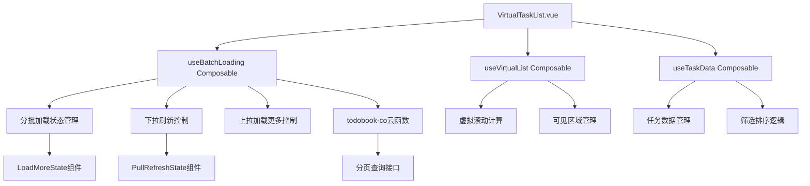

# 设计文档

## 概述

将VirtualTaskList.vue组件改造为支持长列表分批加载功能。通过在现有虚拟滚动基础上增加分批加载机制，提升大数据量场景下的用户体验和系统性能。设计方案基于uni-app生命周期函数和云函数分页接口，与现有架构无缝集成。

## 架构

### 整体架构图



### 分层设计

1. **表现层**: VirtualTaskList.vue组件，负责UI展示和用户交互
2. **业务逻辑层**: useBatchLoading组合函数，管理分批加载逻辑
3. **数据层**: 云函数接口，提供分页数据查询
4. **状态管理层**: 响应式状态管理，同步UI状态

## 组件和接口

### 核心组件设计

#### 1. useBatchLoading Composable

```javascript
// 分批加载组合函数
export function useBatchLoading(options) {
  // 分页状态
  const currentPage = ref(1)
  const pageSize = ref(20)
  const hasMore = ref(true)
  const totalCount = ref(0)
  
  // 加载状态
  const isLoadingMore = ref(false)
  const isRefreshing = ref(false)
  const loadMoreStatus = ref('more') // more, loading, noMore
  
  return {
    currentPage,
    pageSize, 
    hasMore,
    totalCount,
    isLoadingMore,
    isRefreshing,
    loadMoreStatus,
    loadNextPage,
    refresh,
    resetPagination
  }
}
```

#### 2. LoadMoreIndicator 组件

基于uni-load-more组件，显示加载更多状态：

```vue
<template>
  <uni-load-more 
    :status="status"
    :show-icon="showIcon"
    :icon-type="iconType"
    :color="color"
    @click="handleLoadMore">
  </uni-load-more>
</template>
```

#### 3. PullRefreshIndicator 组件

配合页面onPullDownRefresh生命周期，显示下拉刷新状态。

### 云函数接口设计

#### getTodoItemsPaginated 接口

```javascript
// 新增分页查询任务接口
async function getTodoItemsPaginated(params) {
  const {
    todobook_id,
    page = 1,
    pageSize = 20,
    filter = 'all', // all, todo, completed
    tags = [],
    sort = { field: 'created_at', order: 'desc' },
    searchKeyword = ''
  } = params
  
  // 构建查询条件
  const where = buildQueryConditions(params)
  
  // 执行分页查询
  const result = await db.collection('todo_items')
    .where(where)
    .orderBy(sort.field, sort.order)
    .skip((page - 1) * pageSize)
    .limit(pageSize)
    .get()
    
  // 获取总数（仅首页查询）
  const total = page === 1 ? await getTotalCount(where) : undefined
  
  return {
    code: 0,
    data: {
      tasks: result.data,
      pagination: {
        page,
        pageSize,
        total,
        hasMore: result.data.length === pageSize
      }
    }
  }
}
```

#### buildQueryConditions 辅助函数

```javascript
function buildQueryConditions(params) {
  const { todobook_id, filter, tags, searchKeyword } = params
  
  let where = db.command.and({
    todobook_id,
    parent_id: null // 只查询主任务
  })
  
  // 状态筛选
  if (filter === 'todo') {
    where = db.command.and(where, { status: 'todo' })
  } else if (filter === 'completed') {
    where = db.command.and(where, { status: 'completed' })
  }
  
  // 标签筛选
  if (tags && tags.length > 0) {
    where = db.command.and(where, {
      tags: db.command.in(tags)
    })
  }
  
  // 关键词搜索
  if (searchKeyword) {
    const regex = new RegExp(searchKeyword, 'i')
    where = db.command.and(where, db.command.or([
      { title: regex },
      { description: regex }
    ]))
  }
  
  return where
}
```

## 数据模型

### 分页响应模型

```typescript
interface PaginatedResponse {
  code: number
  data: {
    tasks: TaskItem[]
    pagination: {
      page: number
      pageSize: number
      total?: number // 仅首页返回
      hasMore: boolean
    }
  }
  message?: string
}
```

### 分批加载状态模型

```typescript
interface BatchLoadingState {
  currentPage: number
  pageSize: number
  hasMore: boolean
  totalCount: number
  isLoadingMore: boolean
  isRefreshing: boolean
  loadMoreStatus: 'more' | 'loading' | 'noMore'
  error: string | null
}
```

### 虚拟滚动集成模型

```typescript
interface VirtualScrollIntegration {
  // 任务数据累积数组
  allTasks: TaskItem[]
  // 当前可见任务（虚拟滚动计算得出）
  visibleTasks: TaskItem[]
  // 滚动容器高度（动态计算）
  totalHeight: number
  // 上下偏移量
  offsetTop: number
  offsetBottom: number
}
```

## 错误处理

### 错误分类和处理策略

#### 1. 网络错误
- **场景**: 网络请求失败、超时
- **处理**: 显示错误提示，提供重试按钮
- **UI**: 在加载指示器位置显示"加载失败，点击重试"

#### 2. 数据错误
- **场景**: 返回数据格式错误、空数据
- **处理**: 记录错误日志，回退到默认状态
- **UI**: 显示友好的错误信息

#### 3. 状态冲突错误
- **场景**: 用户快速操作导致的状态冲突
- **处理**: 防抖处理，阻止重复请求
- **UI**: 加载期间禁用相关操作

### 错误恢复机制

```javascript
// 错误恢复策略
const errorRecovery = {
  // 网络错误重试
  networkError: {
    maxRetries: 3,
    retryDelay: 1000,
    exponentialBackoff: true
  },
  
  // 数据错误回退
  dataError: {
    fallbackToCache: true,
    showErrorBoundary: true
  },
  
  // 状态冲突防护
  stateConflict: {
    debounceTime: 300,
    preventDuplicateRequests: true
  }
}
```

## 测试策略

### 单元测试

#### 1. useBatchLoading Composable测试
```javascript
describe('useBatchLoading', () => {
  test('应该正确初始化分页状态', () => {
    const { currentPage, pageSize, hasMore } = useBatchLoading()
    expect(currentPage.value).toBe(1)
    expect(pageSize.value).toBe(20)
    expect(hasMore.value).toBe(true)
  })
  
  test('加载下一页应该更新页码', async () => {
    const { currentPage, loadNextPage } = useBatchLoading()
    await loadNextPage()
    expect(currentPage.value).toBe(2)
  })
  
  test('刷新应该重置分页状态', async () => {
    const { currentPage, refresh } = useBatchLoading()
    await refresh()
    expect(currentPage.value).toBe(1)
  })
})
```

#### 2. 云函数接口测试
```javascript
describe('getTodoItemsPaginated', () => {
  test('应该返回正确的分页数据', async () => {
    const result = await getTodoItemsPaginated({
      todobook_id: 'test_book_id',
      page: 1,
      pageSize: 20
    })
    
    expect(result.code).toBe(0)
    expect(result.data.tasks).toBeInstanceOf(Array)
    expect(result.data.pagination.page).toBe(1)
  })
  
  test('应该正确处理筛选条件', async () => {
    const result = await getTodoItemsPaginated({
      todobook_id: 'test_book_id',
      filter: 'completed'
    })
    
    result.data.tasks.forEach(task => {
      expect(task.status).toBe('completed')
    })
  })
})
```

### 集成测试

#### 1. 虚拟滚动与分批加载集成
- 测试数据加载后虚拟滚动高度计算的正确性
- 测试滚动位置在数据更新后的保持性
- 测试筛选条件变更时的数据重置

#### 2. 用户交互流程测试
- 下拉刷新 → 数据重置 → 虚拟滚动重置
- 上拉加载 → 数据追加 → 虚拟滚动高度更新
- 筛选变更 → 分页重置 → 数据重新加载

### 性能测试

#### 1. 内存使用测试
- 监控大数据量加载时的内存占用
- 测试虚拟滚动的内存回收机制
- 验证组件卸载时的内存清理

#### 2. 渲染性能测试
- 测量不同数据量下的首屏渲染时间
- 监控滚动过程中的帧率表现
- 验证分批加载对滚动流畅度的影响

#### 3. 网络性能测试
- 测试不同网络条件下的加载表现
- 验证请求去重和防抖机制
- 监控并发请求的处理能力

## 实现细节

### 1. 虚拟滚动集成策略

**数据追加时的高度重计算**:
```javascript
const appendTasks = (newTasks) => {
  // 追加新数据
  allTasks.value.push(...newTasks)
  
  // 更新虚拟滚动总高度
  nextTick(() => {
    const newTotalHeight = allTasks.value.length * estimatedItemHeight
    virtualScrollRef.value?.updateTotalHeight(newTotalHeight)
  })
}
```

**筛选条件变更时的状态重置**:
```javascript
const handleFilterChange = async (newFilter) => {
  // 重置分页状态
  resetPagination()
  
  // 重置虚拟滚动位置
  virtualScrollRef.value?.scrollToTop()
  
  // 重新加载数据
  await loadTasks(newFilter)
}
```

### 2. 状态同步机制

**跨组件状态同步**:
```javascript
// 通过事件总线同步状态变更
const syncStateAcrossComponents = () => {
  // 任务状态变更
  uni.$on('task-status-changed', (taskId, newStatus) => {
    updateTaskInAllPages(taskId, { status: newStatus })
  })
  
  // 筛选条件变更
  uni.$on('filter-changed', (newFilter) => {
    handleFilterChange(newFilter)
  })
}
```

### 3. 性能优化策略

**请求防抖**:
```javascript
const debouncedLoadMore = debounce(loadNextPage, 300)
```

**智能预加载**:
```javascript
const checkPreload = (scrollTop, totalHeight) => {
  const loadThreshold = totalHeight * 0.8
  if (scrollTop > loadThreshold && hasMore.value && !isLoadingMore.value) {
    debouncedLoadMore()
  }
}
```

**内存管理**:
```javascript
const manageMemory = () => {
  // 当页面数据过多时，清理远离视口的数据
  if (allTasks.value.length > MAX_CACHED_TASKS) {
    const visibleRange = getVisibleRange()
    keepOnlyVisibleAndBuffer(visibleRange)
  }
}
```

### 4. 兼容性处理

**平台差异适配**:
```javascript
const platformConfig = {
  // H5平台配置
  'h5': {
    pageSize: 20,
    preloadThreshold: 100,
    enablePullRefresh: false // H5使用scroll-view的refresher
  },
  
  // 小程序平台配置
  'mp': {
    pageSize: 15,
    preloadThreshold: 80,
    enablePullRefresh: true // 小程序使用页面生命周期
  },
  
  // App平台配置
  'app': {
    pageSize: 25,
    preloadThreshold: 120,
    enablePullRefresh: true
  }
}
```

### 5. 缓存策略

**多级缓存机制**:
```javascript
// 1. 内存缓存：当前会话期间的数据
const memoryCache = new Map()

// 2. 本地存储：跨会话的关键数据缓存
const persistentCache = {
  key: (bookId, filter, page) => `tasks_${bookId}_${filter}_${page}`,
  set: (key, data, ttl = 300000) => { // 5分钟TTL
    uni.setStorageSync(key, {
      data,
      expires: Date.now() + ttl
    })
  },
  get: (key) => {
    const cached = uni.getStorageSync(key)
    if (cached && cached.expires > Date.now()) {
      return cached.data
    }
    return null
  }
}
```

## 可行性分析结论

### 技术可行性评估

**✅ 完全改造为分批加载是可行的**

#### 1. 现有架构支持
- **数据流清晰**: detail.vue → loadBookDetail(includeTasks: true) → initializeTasks(allTasks.value)
- **组合函数设计**: useBookData和useTaskData已经分离，便于独立改造
- **虚拟滚动就绪**: useVirtualList.js已支持动态数据追加和高度重计算

#### 2. 云函数基础
- **查询能力**: 现有getTodoBookDetail已支持复杂查询和排序
- **扩展空间**: 可直接在module/task中添加分页查询方法
- **权限体系**: checkTodoBookPermission确保数据安全

#### 3. 关键改造点
- **useBookData**: 移除includeTasks选项，专注项目册基本信息
- **useTaskData**: 改造initializeTasks为分批加载机制
- **VirtualTaskList**: 集成分批加载状态管理

### 技术风险评估

#### 1. 低风险项 ✅
- **虚拟滚动集成**: 现有useVirtualList已考虑动态数据
- **状态管理**: Vue3响应式系统天然支持数据追加
- **UI组件**: uni-load-more等组件已经成熟

#### 2. 中等风险项 ⚠️
- **筛选排序一致性**: 需确保分页查询与前端筛选逻辑完全一致
- **父子任务关系**: organizeParentChildTasks需要处理分批加载的父子关系
- **评论数据同步**: 现有按需加载机制需要适配分批场景

#### 3. 可控风险项 ⚡
- **数据一致性**: 通过时间戳或版本号机制确保分页数据一致性
- **内存管理**: 大数据量时需要合理清理远离视口的数据
- **网络异常**: 完善的错误处理和重试机制

## 完全改造方案

### 核心设计原则
1. **彻底替换**: 完全移除一次性加载逻辑，所有数据通过分批获取
2. **渐进增强**: 保持现有UI交互体验，用户无感知切换
3. **性能优先**: 首屏快速响应，后续数据按需加载
4. **数据一致**: 确保筛选、排序、搜索在分批加载下的一致性